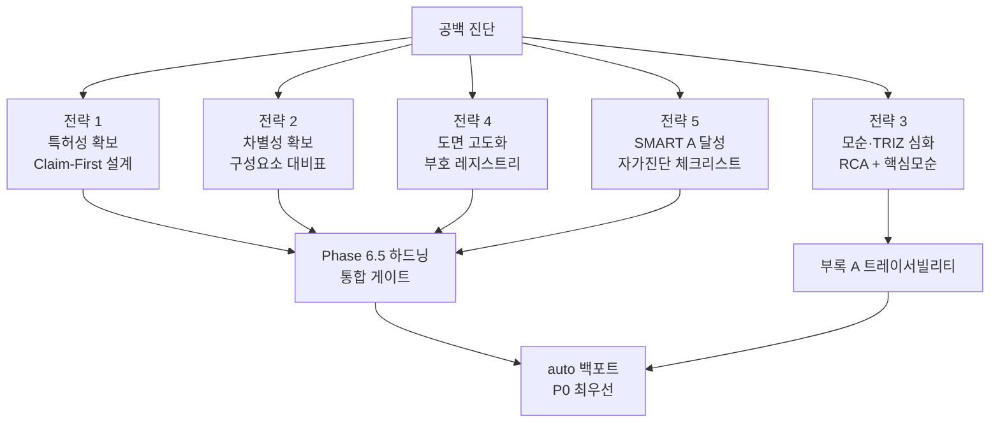
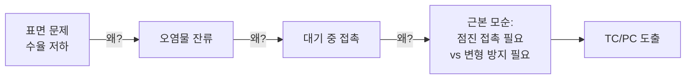
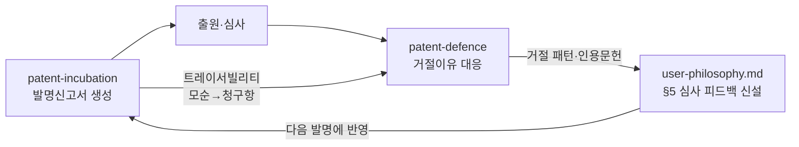

# 특허 창출 스킬 궁극 개선 전략

> [!info] 대상 스킬
> `patent-incubation-auto` · `patent-incubation-interactive` (KIMM 직무발명내용설명서 자동 생성 워크플로우)
> 본 문서는 5대 전략 영역(특허성 확보 / 선행특허 차별성 / 모순 기반 문제정의·TRIZ / 도면 고도화 / SMART A 달성)의 진단과 개선책, 그리고 실행 로드맵을 담는다.

---

## 0. 진단 요약 (Executive Summary)

### 현재 강점 (2026-07 기준)

| 영역 | 이미 갖춘 장치 |
|------|---------------|
| 워크플로우 | interactive: Gate 0~7 + Phase 6.5 청구항 하드닝 + 되돌림 체인 + Background prefetch |
| 차별성 | rejection_combinations(예상 거절조합) 필수화, S5 국제검색(PCT 의도 시), IFR 커버리지 3분류(novel/partial/disclosed) |
| 인용 무결성 | 클린 리스트 원칙 + verify_citations.py 강제 게이트 (마커 위조 사고 재발 방지) |
| 도면 | Mermaid/SVG/matplotlib 3도구 정책표, svg2png 4중 방어, EMF·outlined-SVG PPT 파이프라인, 규칙 A/B/C |
| 학습 루프 | user-philosophy.md 발명 패턴 축적 (§4 반복 패턴) |

### 3대 구조적 공백

> [!warning] 공백 1 — auto/interactive 비대칭 (최우선)
> **auto 스킬에는 Phase 6.5 청구항 하드닝, 예상 거절조합, 클린 리스트 원칙, verify_citations.py 강제 게이트, 국제검색 S5가 전혀 없다** (grep 확인). 특히 auto의 Phase 6c는 **구식 `(정합 확인!)` 마커 방식 그대로** — interactive가 클린 리스트로 전환한 계기였던 "마커 위조 → DOI 6건 404 판명" 환각 사고 경로에 auto는 여전히 노출되어 있다. 자동 모드일수록 사용자 검토가 없어 기계 게이트가 더 절실한데, 정작 auto가 가장 빈약하다.
>
> 참고: 두 스킬의 에이전트 fork는 게이트 표시 필드만 추가한 얇은 fork로 **분석 엔진은 사실상 하나** — 백포트 비용은 낮다.

> [!warning] 공백 2 — 청구항 '작성 문법'의 부재
> phase6-disclosure-writer의 §8 지침은 interactive fork 기준 2줄("독립항 1+ + 종속항 2-4개. 방법/장비/소자 고려. 회피설계 반영"), auto 원본 기준 6개 불릿에 불과하다(팩트 검증 완료). 어느 쪽에도 청구항 구조(전제부/전이부/특징부), 구성요소 연결관계 서술, 선행어 규칙 같은 '작성 문법'이 없어 **Phase 6.5가 사후 교정에 의존**한다. 발명의 최고가치 산출물에 대한 지침이 가장 빈약하다.

> [!warning] 공백 3 — 부호(reference numeral) 체계 부재
> 도면·§6·§8·도면설명 간 부호 동기화 장치가 없다. 현행 SVG는 텍스트 라벨 직접 표기 방식으로, 특허 도면 표준(부호+인출선+부호의 설명)과 거리가 있다.

### 개선 전략 지도



---

## 1. 전략 1 — 특허성 확보 전략

### 1.1 진단

- 특허성이 evaluation-matrix 5축 중 0.20 가중치의 **단일 정량 점수**로 종합에 반영 — 신규성/진보성 세부 서술표는 존재하나 정성 코멘트에 그치고 점수 산정에 분리 반영되지 않음
- §8 청구범위 작성 지침 3줄 — 청구항 문법 부재 (공백 2)
- §6은 상세하나(30%+ 토큰, 15~30 bullet) **청구항과의 지지(support) 관계가 규정되지 않음** — §6이 먼저 서술되고 §8이 뒤따르는 순서라, 청구항 구성요소가 명세서에 뒷받침되는지 보장 장치 없음

### 1.2 개선책

#### (a) Claim-First 설계 단계 신설 ★핵심

Phase 6 내부 작성 순서를 역전한다:

```
현행: §3 배경 → §4 종래기술 → §5 목적 → §6 구성 → §7 효과 → §8 청구범위
개선: [청구항 골격 선행 설계] → §6 (청구항 전 구성요소를 지지하도록) → §8 확정 → 나머지
```

- 필수 구성요소 최소집합(minimal essential set) 도출 → 독립항 골격
- 각 IFR·회피 한정요소 → 종속항 트리 배치
- §6의 모든 bullet은 "어느 청구항 구성요소를 지지하는가"를 내부적으로 추적

#### (b) 청구항 작성 문법 가이드 신설 — `reference/claim-drafting.md`

| 항목 | 규칙 |
|------|------|
| **제1원칙** | 독립항 = **신규성·진보성을 지탱하는 최소 구성의 결합**(novelty-bearing minimal combination). '짧게'가 목적이 아니라, 결합 신규성(전략 2-b)을 이루는 요소는 **전부 독립항에 포함**하되 그 외는 배제 — 신규성 지탱 요소 누락은 청구 불성립, 잉여 요소 포함은 권리 축소 |
| 구조 | 전제부(공지 부분) / 전이부("포함하는") / 특징부(신규 구성) |
| 서술 순서 | 구성요소 열거 → 연결관계 → 기능·작용 한정 |
| 선행어 | "상기 X"는 반드시 선행 기재 후 사용 (작성 시점 준수 — 6.5 사후검사에만 의존하지 않음) |
| 상위개념화 | 구체 용어 → 상위개념/기능적 표현 사다리 적용 (예: "SMA 스프링" → "형상기억 복원수단") — 입력 아이디어를 그대로 청구항화하면 특정 실시예에 갇힘. 사다리 각 단계는 §6 실시예로 뒷받침 |
| 수치·재료 한정 | 독립항에서 배제, 종속항으로 이동 (신규성 지탱에 필수인 경우만 예외) |
| 종속항 | 단계적 fallback 계층 4~6개, 수치·재료·공정조건 한정은 여기로 |
| 부호 병기 | 구성요소에 도면 부호 괄호 병기 "챔버(10)" — 부호 레지스트리와 동기화 |
| 카테고리 | 물건+방법 병행 필수, 장치/시스템 추가 검토 (user-philosophy 3축 포트폴리오) |

> [!note] SMART 길이 기준의 위치
> "독립항 글자수" SMART 감점 경향은 청구항 **작성 규칙이 아니라** Phase 6.5의 **경고 신호**로만 사용한다(§5.3). 청구항 길이는 신규성 지탱 결합의 크기가 결정하는 것이지 점수 최적화의 대상이 아니다 — §5.3의 "SMART 왜곡 배제" 원칙과 일관.

#### (c) 진보성 논증 프레임 구조화

- 서술 골격은 **Problem-Solution Approach**(객관적 기술 과제 → 최근접 선행기술 → 해결수단의 비자명성)를 따르고, §4(종래기술 문제점)와 §7(효과)에 3논거를 명시적 서술 패턴으로 요구:
  1. **결합 곤란성**: 선행문헌 간 결합에 동기 부재/기술적 장애
  2. **상승효과**: 결합 시 개별 효과 합을 초과하는 시너지 (정량 수치 동반)
  3. **Teaching away**: 선행기술이 본 발명 방향을 회피·부정하는 기재
- 보조 논거로 2차적 고려사항(장기 미해결 과제, 상업적 성공 가능성) 서술 위치 확보
- phase5 `rejection_combinations`의 방어 논거(defense)를 §7 효과 서술에 자동 연결하는 파이프 신설

#### (d) 특허성 축 3분해 — evaluation-matrix.md 개정

| 세부 축 | 배점 | 판단 기준 |
|--------|------|----------|
| 신규성 | /10 | Phase 5 ifr_coverage와 정합 (novel=8~10, partial=4~7, disclosed=1~3) |
| 진보성 | /10 | 3논거(결합곤란/상승효과/teaching away) 성립 개수 |
| 실현·뒷받침 | /10 | 실시예로 재현 가능한 구체성 (112a) |

#### (e) 실시예 다양성 규칙

- §6 변형 실시예에 재료 치환 ≥1, 수치범위 ≥1, 구조 변형 ≥1 의무화 → SMART 명세서 충실도·권리범위 방어 겸용

#### (f) 발명 단일성 검토 항목

- 3축(방법+장치+소자) 청구항이 단일 발명 개념으로 묶이는지 Phase 6.5에서 점검, 위반 우려 시 분할출원 전략 문구 제시

#### (g) 특허성 재채점 + 평가 레인 분리 ★신규 발견

- **현행 결함**: Phase 4가 특허성(0.20)을 **선행특허 조사(Phase 5) 이전에** 채점하고, 조사 후 재채점 절차가 없다(정성 코멘트만). 단일 평가자 + LLM 낙관 편향 → 점수 인플레이션
- 개선: **Phase 5.5(재채점) 신설** — Phase 4는 실행 순서상 Phase 5보다 앞서므로 phase4-evaluator 수정만으로는 불가(critic 지적). Phase 5 완료 직후 오케스트레이터(SKILL.md)가 특허성 축 재채점을 호출: ifr_coverage(novel/partial/disclosed) 반영 + 재채점 전/후 이력을 evaluation.json에 기록. 상위 IFR에 대해 **반대심문 평가자**(별도 에이전트, "이 IFR이 특허성이 없는 이유를 논증하라") 레인 분리 — 작성/검토 분리 원칙 적용

#### (h) 요약서(초록) 생성 단계 추가

- 현행 산출물에 요약서가 없음 — 출원 서류 세트(명세서·청구범위·요약서·도면) 중 요약서 자동 생성을 Phase 6 출력에 추가 (§1+§5+§6 핵심으로 400자 내외)

---

## 2. 전략 2 — 기존 특허와 차별성 확보 전략

### 2.1 진단

- interactive는 이미 상당 수준 (rejection_combinations, S5, 3분류 커버리지, PDF --verify)
- 남은 약점: 유사/차이가 **산문 서술**이라 구성요소 단위 누락 검증 불가, 국제검색이 조건부, TF-IDF가 초록 중심

### 2.2 개선책

#### (a) 구성요소 대비표(Claim Chart) 신설 ★핵심

위험도 '중간' 이상 선행특허마다 엘리먼트 단위 매핑을 의무화:

| 본 발명 구성요소 (§8 독립항) | 선행특허 A | 선행특허 B | 차별 근거 |
|------------------------------|-----------|-----------|----------|
| 구성요소 1 | ○ 개시 | ○ 개시 | — |
| 구성요소 2 | △ 유사 | × 미개시 | 소재·구동 방식 상이 |
| 구성요소 1+2+3 결합 | × | × | **결합 미개시 = 신규성 핵심** |

- `prior_art.json`에 `claim_chart[]` 필드 추가, Gate 5 표시에 포함
- §8 독립항 구성요소와 1:1 연결 → 어느 엘리먼트가 신규성을 지탱하는지 명시

#### (b) "결합 신규성" 논증 템플릿 승격

- user-philosophy의 검증 패턴("개별 요소는 공지, 3요소 결합은 미개시")을 phase5→phase6 표준 논증 구조로 문서화
- 대비표 마지막 행("결합" 행)이 이 논증의 근거 데이터가 됨

#### (c) 역회피 분석 (Design-Around Inversion)

- "경쟁자가 본 발명을 회피하려면?" 관점에서 회피 경로 3개 도출
- 각 경로를 봉쇄하는 종속항을 추가 → Phase 6.5 점검항목 4(거절조합 대응)와 대칭 구조
- **실행 순서 주의(critic 지적)**: Phase 6.5 하드닝(P0)이 역회피 종속항을 점검하려면 공급원이 먼저 있어야 함 → **최소 버전(경로 3개 도출→종속항)은 P1으로 편성**, TESE 결합 심화만 P2

#### (d) 국제검색 트리거 확대

- 현행: PCT/해외 출원 의도 시 필수
- 개선: **위험도 高 선행특허 존재 시에도** Google Patents 패밀리 확인 의무화 (국내 등록특허의 해외 패밀리가 더 넓은 청구항을 가질 수 있음)

#### (e) 검색 재현성·커버리지 정직성

- 검색식 이력 로그(회차별 키워드·건수), 미검색 영역("국내 한정 결론") 명시 유지·확장

#### (f) 검색·유사도 엔진 개선 (현실적 범위)

- TF-IDF 입력을 초록 → 초록+대표청구항으로 확장 (청구항이 권리범위의 실체)
- **Google Patents 패밀리 조회**: 위험도 高 국내 특허의 해외 패밀리 확인 (더 넓은 청구항 보유 가능) — 기존 인프라(WebFetch)로 실행 가능
- **FTO(침해 회피)와 특허성(등록 가능성) 조사 관점 구분**: 현행은 혼재 — 위험도(risk_level)가 어느 관점의 위험인지 명시
- 임베딩 의미검색·INPADOC API·CPC 확장검색은 **장기 검토로 강등** — 별도 백엔드 구축이 필요해 LLM 스킬 범위를 초과, 유지비 대비 실익 불명 (critic 검토 반영)

#### (g) 자기공지·비특허문헌(NPL) 선행조사 + 공지예외 전략 ★치명 공백 (critic 발견)

- **문제**: KIMM은 연구기관 — 발명자가 **자기 논문·학회 발표를 특허 출원보다 먼저 공개**하여 자기 공지로 신규성·진보성을 상실하는 것이 연구기관 실무 최다 무효 사유. 현행 Phase 5는 특허문헌(KIPRIS)만 조사하고, 자기 선행공개 확인도 공지예외 안내도 전무
- 개선:
  1. Phase 5에 **자기 선행공개 조회 필수 단계** 추가: 발명자 본인·KIMM 소속 저자의 논문(CrossRef/OpenAlex 저자 검색)·학회 발표·보도자료를 조회 — Phase 6c의 기존 CrossRef 인프라 재사용 가능
  2. §2(논문발표 여부)를 형식 기재에서 **실질 조사 결과**로 승격: 자기공개 발견 시 공개일 기재
  3. 자기공지 발견 시 **공지예외주장(신규성 의제, 공개일로부터 12개월 내 출원) 기한·요건 경고**를 발명신고서와 최종 보고에 표시
  4. 참조문헌으로 입력된 발명자 자신의 논문(source_files)은 자동으로 자기공지 후보로 검사

---

## 3. 전략 3 — 모순 기반 문제정의 + TRIZ 아이디어 창출 전략

### 3.1 진단

- 매트릭스·40원리·분리법칙·IFR≥10·커버리지 매핑은 견고
- 그러나 Phase 1 파라미터 후보 → 모순쌍으로 **바로 점프** — '중요한 문제'의 근본성 검증 단계 없음
- 모순 2~4개가 병렬 나열될 뿐 우선순위·인과 구조 없음 (상한 2~4개 자체가 탐색폭 조기 축소)
- Phase 1의 "5요소 분석"은 TRIZ 정통 도구가 아님 — **기능분석(Function Analysis)·인과사슬분석(CECA)·자원분석(Resource Analysis)·트리밍(Trimming)·S곡선** 전부 누락
- Phase 2에 IFR **양(≥10) 게이트만 있고 질 게이트 없음** — 신규성 프리체크·구현가능성 스크리닝 부재

### 3.2 개선책

#### (a) 인과사슬분석(CECA) 전치 ★핵심 — "모순에 근거한 중요한 문제의 정의"

TRIZ 정통 도구인 Cause-Effect Chain Analysis를 Phase 1과 2 사이에 삽입 (왜-왜 분석의 체계화):



- `triz_system.json`에 `root_cause_chain[]` 필드 추가
- 모순은 반드시 근본원인 수준에서 정의 — 표면 증상 수준의 모순은 파생특허밖에 못 만든다

#### (b) 핵심 모순(Root Contradiction) 선별

- 모순 간 인과 그래프에서 최상류 모순 1개를 '발명의 심장'으로 지정
- §5 발명의 목적과 1:1 대응 → 발명 스토리 일관성 확보
- Gate 2A에 "핵심/부수" 표시 이미 존재 → 인과 그래프 근거로 격상

#### (c) 물질-장(Su-Field) 분석 + 76 표준해 선택 도입

- 39×39 매트릭스는 파라미터 상충형 문제에 최적 — **기능 부족/과잉/유해 작용형** 문제는 물질-장 모델이 우수
- Phase 2에 옵션 경로 추가: 문제 유형 판별 → 매트릭스 or Su-Field 선택
- `reference/triz-sufield-76standards.md` 신설 (76 표준해 요약)

#### (d) 기술진화법칙(TESE) 기반 미래 청구항

- 시스템 진화 다음 단계(동적화·세분화·필드 전이·이상성 증가)를 예측
- 미래 회피 경로를 종속항으로 선점 — 역회피 분석(전략 2-c)과 결합
- `reference/triz-evolution-trends.md` 신설

#### (e) 이상성 평가 + IFR 질 게이트

- IFR별 이상성(유익효과 대비 비용+유해효과)을 evaluation-matrix 보조 지표로 추가 — 단, 발명 초기의 수치 산정은 false precision을 유발하므로 **정성 3단계(高/中/低) 등급**으로 운용 (critic 반영)
- IFR 질 게이트 신설: 각 IFR에 대해 (1) 신규성 프리체크(자명한 공지기술 조합 여부 자문), (2) 구현가능성 1줄 논증을 통과해야 카운트 — "양 10개" 게이트를 "질 통과 10개"로 격상

#### (e-2) Phase 1 도구 확장 — 기능분석·자원분석·트리밍

- **기능분석**: 구성요소 간 유용/유해/과잉/부족 기능 매트릭스 — 유해·부족 기능이 모순 후보의 체계적 원천
- **자원분석**: 시스템 내 미활용 자원(물질·에너지·공간·시간·정보) 목록 — user-philosophy의 "버려지는 에너지 재활용" 철학을 정식 단계로 승격
- **트리밍**: 구성요소 제거 후 기능 재배치 시나리오 — 구조적 단순화 철학의 도구화. 트리밍 결과가 그 자체로 강한 IFR(부품 수 감소 = 비용·신뢰성 개선)
- 39파라미터 매핑 검증: 선택한 파라미터가 실제 문제 서술과 대응하는지 근거 문장 의무화

#### (f) 모순→원리→IFR→청구항 트레이서빌리티 ★자산화

- 부록 A에 매핑 테이블 추가: 각 청구항이 어느 모순의 해결인지 기록
- **거절이유 통지 대응 시 논거 재구성 자산** — patent-defence 스킬이 이 매핑을 읽어 의견서 논거로 활용하는 폐루프 구축

---

## 4. 전략 4 — 그림 및 도면 생성 고도화 전략

### 4.1 진단

- 도구 정책·변환 파이프라인·규칙 A/B/C는 성숙
- 결정적 공백: **부호 체계 부재** (공백 3), 출원 규격(흑백 라인·해칭) 미준수, 텍스트 겹침 검증이 육안(Read) 의존

### 4.2 개선책

#### (a) 부호 레지스트리(Reference-Numeral Registry) 신설 ★핵심

`{output_dir}/numeral_registry.json`:

```json
{
  "numbering_rule": "주요부 10단위(10,20,30), 세부 1단위(11,12), 변형례 100단위",
  "numerals": [
    {"no": 10, "name": "챔버", "sections": ["§6", "§8 청구항1"], "figures": ["도1", "도3"]},
    {"no": 11, "name": "SMA 복합재료 벽", "sections": ["§6"], "figures": ["도3"]}
  ]
}
```

- Phase 6에서 §6 작성 시 레지스트리 생성 → §8 부호 병기 → Phase 6b 도면 라벨 → §9 "부호의 설명"까지 단일 소스
- **검증 스크립트 `verify_numerals.py` 신설**: §6·§8·도면 SVG 텍스트·§9 부호설명 간 정합 검사, exit!=0 시 Phase 7 차단 (verify_citations.py 강제 게이트 패턴 재사용)

#### (b) 출원 규격 모드 (Dual-Mode SVG)

| 모드 | 용도 | 스타일 |
|------|------|--------|
| 설명서 모드 (현행) | 발명신고서·발표자료 | 의미 컬러 팔레트 (p=적, n=청...) |
| **출원 모드 (신설)** | 명세서 첨부 도면 | 흑백 라인, 단면 해칭(재료별 규격), 부호+인출선, 색 사용 금지 |

- svg-figure-creation.md에 "§10 출원 모드" 추가: 해칭 패턴 defs 라이브러리(금속=사선, 수지=교차, 유리=점), 인출선 규칙(직선/꺾은선, 부품 위 직접 표기 금지 — 규칙 B의 확장)

#### (c) SVG 컴포넌트 라이브러리 자산화 (우선순위 최하)

- 반복 등장 요소(챔버, 롤, 기판, 밸브, 펌프, 스테이지, 히터)를 `figures/lib/*.svg` 조각으로 축적
- 규칙 A(원본 재활용)의 일반화 — 발명마다 재작도하지 않고 조립
- 단, 발명 간 도면 상이성으로 재사용률이 낮을 수 있음 — 시도하되 관리비용이 실익을 넘으면 중단 (critic 권고, P2 최하 순위)

#### (d) 도면 세트 표준 + 대표도 지정

- 기존 특허 유형별 도면 세트 표에 **대표도 1장 지정 규칙** 추가 (§9 첫 도면 = 대표도, 발명 전체를 1장으로 대변)
- 최소 도면 수 하한: 5장 (SMART 명세서 충실도 대응)

#### (e) 기하 검증 현실화

- 규칙 B(텍스트 비겹침)의 Read 육안 검증을 보조하는 **라벨 좌표 목록 덤프 스크립트** 추가: SVG의 모든 `<text>` 좌표·내용을 표로 추출해 LLM이 겹침 후보를 구조적으로 판독 — 완전 자동 bounding-box 판정은 폰트 메트릭 의존으로 오탐 다발 우려가 있어 배제 (critic 반영)

---

## 5. 전략 5 — SMART 지수 A 달성 전략

### 5.1 조사 결과 요약 (2026-07-05 웹 조사, 출처 하단)

| 항목 | 내용 |
|------|------|
| 운영 | 한국발명진흥회(KIPA), SMART5 (IP5 3.4억건) |
| 등급 | 9등급 (AAA·AA·A·BBB·BB·B·CCC·CC·C), stanine 백분위 |
| A등급 | 상위 3번째 등급, A 이상 ≈ 상위 약 23% 추정 (공식 컷 비공개) |
| 평가 부문 | 권리성 / 기술성 / 활용성 (가중치 비공개) |
| **핵심 전제** | **등록특허 중심 평가**(실무 출처 복수 확인, 공식 문서 미확인 — 출원특허 평가 여부는 확인 필요) — 어느 쪽이든 출원 명세서 구조가 등록 후 등급을 결정 |

> [!important] 핵심 반전 — 독립항은 짧게
> 실무 분석에 따르면 SMART는 **독립항 글자수가 길수록 감점**하는 기계적 경향이 있다. 광범위한 권리를 위해 독립항을 상세히 쓰면 오히려 불리 → **독립항 간결 + 한정요소는 종속항으로 분산**. 이는 권리범위 방어 전략(전략 1-b)과도 정확히 일치한다.

### 5.2 출원인 통제 가능 요소 → 스킬 내장 전략

| SMART 대응 요소 | 통제 시점 | 스킬 반영 위치 |
|----------------|----------|---------------|
| 독립항 간결성 | 출원 | Phase 6.5 경고 신호로만 (청구항 규칙 아님 — 전략 1-b 제1원칙 참조) |
| 청구항 수·종속항 계층 균형 | 출원 | 종속항 트리 4~6 fallback (전략 1-b) |
| 물건+방법 카테고리 병행 | 출원 | 카테고리 체크 (전략 1-b) |
| 명세서 충실도·실시예 | 출원 | 실시예 다양성 규칙 (전략 1-e) |
| 도면 수·충실도 | 출원 | 도면 하한 5장 + 대표도 (전략 4-d) |
| 활용성 서술 | 출원 | §7에 "본 발명은 [산업]에 적용되어 [분야]에 활용" 패턴 의무화 |
| 차별성 반복 기술 | 출원 | §4·§6·§7 차별 요소 3중 기술 (전략 2-b 연동) |
| 용어 일관성(AI 판독성) | 출원 | 부호 레지스트리 (전략 4-a)와 시너지 |
| 패밀리 규모·IPC 다양성 | 출원 전략(비용) | 안내 문구만 (PCT/다국가 출원 권고) |
| 피인용·심사경과 | 사후·외생 | 통제 불가 — 목표에서 제외 |

### 5.3 SMART 사전 자가진단 체크리스트 — Phase 6.5 통합

Phase 6.5 하드닝 점검표에 SMART 축을 추가 (기존 5항목 + 신규 5항목):

```
[기존] 112(b) / 트리 정합 / 권리계층 / 거절조합 대응 / 수치한정 위치
[신규] 독립항 글자수 (경고 신호로만 — 트리거: 종속항 이동 가능한 수치·재료 한정이 독립항에 잔존. 절대 글자수 임계 아님)
[신규] 카테고리 병행 (물건+방법 최소)
[신규] 종속항 계층 균형 (독립항당 4~6 — §8 지침 상향(P0 #3)과 동시 시행: 구 지침 "2-4개"로 작성된 명세서 오탐 방지)
[신규] 활용성 서술 존재 (§7 패턴 매칭)
[신규] 실시예·도면 수 하한 (≥3 / ≥5)
```

> [!note] 한계 고지
> SMART는 기계적 평가의 한계가 보고되어 있다(변리사협회 Axis Value와 등급 불일치 사례, 화합물 특허 2등급 vs 5등급 등). 체크리스트는 SMART '최적화'가 아니라 **좋은 명세서의 조건이 SMART 점수와 겹치는 영역**을 우선한다. SMART만을 위한 왜곡(예: 무의미한 청구항 수 부풀리기)은 배제한다.

---

## 6. 횡단 개선 — 스킬 아키텍처

### 6.1 auto 백포트 (P0 최우선)

auto에 누락된 interactive의 품질 장치를 이식하되, auto의 "무게이트 자동 진행" 성격을 유지:

| 이식 항목 | auto에서의 형태 |
|----------|----------------|
| Phase 6.5 청구항 하드닝 | 게이트 없이 **자동 점검 + 자동 수정** (issue는 최종 보고에 표시) |
| rejection_combinations | phase5 출력 스키마 동일 적용 |
| 클린 리스트 원칙 + verify_citations.py | 강제 게이트 그대로 (기계 게이트라 사용자 개입 불필요) |
| 국제검색 S5 | 트리거 조건 동일 적용 |
| 도면 규칙 C (도면-설명 동기화) | 동일 적용 |

### 6.2 공유 자원 정책 정리

- 에이전트 8종이 auto/interactive에 이중 존재 → 공통 로직은 auto(=SHARED_SKILL_ROOT)에 단일 유지, interactive fork는 차분(gate_summary·section_summary 등)만 명시하는 현행 패턴을 **모든 에이전트에 일관 적용** (phase6은 이미 이 패턴)

### 6.3 기계 게이트 자체의 한계 보강

- **verify_citations.py**: 현행은 정규식 수준 검사(DOI/특허번호 존재 + 편집문구 부재)만 수행 — (1) **inline `[N]` 인용 개수 ↔ 리스트 항목 수 일치 검사** 추가 (P0 #1 auto 백포트 시 같은 스크립트를 수정하므로 합류), (2) 서지의 의미적 정확성(제목-DOI 실대응)은 에이전트 판단 의존임을 게이트 출력에 명시
- **주의(critic)**: 개수 일치 검사는 **개수는 맞지만 위조된 DOI**를 잡지 못한다 — 이 게이트를 낳은 실증 사고("마커 위조 → DOI 6건 404")와는 직교하는 검사다. 위조 DOI 탐지(원문 대조)는 phase6c 에이전트의 책임이며, 기계 게이트가 환각을 완전 봉쇄한다고 오독하지 말 것
- **Phase 7 (HWPX)**: 다수 실전 버그를 흡수한 견고한 변환기로 개선 우선순위 낮음. 단, 셀 위치가 하드코딩 인덱스(SECTION_CELLS)라 **KIMM 양식 개정 시 취약** — 양식 버전 체크(템플릿 해시 비교) 1줄 방어만 추가

### 6.4 폐루프 학습 (Outcome Feedback)



- user-philosophy.md에 **§5 심사 피드백** 섹션 신설: 실제 거절이유·보정 이력에서 추출한 교훈 축적
- patent-defence 스킬이 부록 A 트레이서빌리티(전략 3-f)를 읽어 의견서 논거를 재구성

---

## 7. 실행 로드맵

### P0 — 즉시 (품질 격차 해소·실증된 사고 경로 차단·등록 불가 방지)

| # | 작업 | 파일 |
|---|------|------|
| 1 | **auto 백포트**: 클린리스트+verify_citations 게이트(구식 마커 방식 제거 — 실증된 환각 사고 경로), Phase 6.5(자동 점검·자동 수정 모드), rejection_combinations, S5 국제검색, 규칙 C. 백포트 시 verify_citations.py에 **inline `[N]` 개수↔리스트 일치 검사**도 함께 추가(같은 파일 1회 수정) | `patent-incubation-auto/SKILL.md` Step 6c, `agents/phase5-prior-art.md`, `agents/phase6c-reference-verifier.md`, `interactive/scripts/verify_citations.py` |
| 2 | **자기공지·NPL 조사 + 공지예외 경고** (연구기관 최다 무효사유 차단) | `agents/phase5-prior-art.md`, 양쪽 SKILL.md, `agents/phase6-disclosure-writer.md` §2 |
| 3 | 청구항 작성 문법 가이드 신설 + §8 지침 확충 (제1원칙=novelty-bearing minimal combination, Claim-First, 전제부/전이부/특징부, antecedent basis, 상위개념화 사다리, 수치한정 종속항 이동) | `reference/claim-drafting.md` (신설), `agents/phase6-disclosure-writer.md` §8 |
| 4 | **Phase 5.5 재채점 신설** (Phase 5 결과 반영 특허성 재채점 + 반대심문 평가자 레인 분리 — 오케스트레이터가 호출) | 양쪽 SKILL.md (Phase 5.5 오케스트레이션), `agents/phase5-prior-art.md` |
| 5 | SMART 자가진단 5항목을 Phase 6.5 점검표에 추가 (독립항 길이는 '경고 신호'로만) | `patent-incubation-interactive/SKILL.md` Phase 6.5 |

### P1 — 단기 (차별성·도면·논증 강화)

| # | 작업 | 파일 |
|---|------|------|
| 6 | 구성요소 대비표(claim_chart) 스키마 + Gate 5 표시 + FTO/특허성 관점 구분 | `agents/phase5-prior-art.md`, 양쪽 SKILL.md |
| 7 | **역회피 분석 최소 버전** (경로 3개 도출→봉쇄 종속항 — Phase 6.5 하드닝의 공급원, 순서 의존성 해소) | `agents/phase5-prior-art.md` |
| 8 | 부호 레지스트리 + verify_numerals.py 강제 게이트 (§6·§8·도면·부호설명 정합) | `agents/phase6-disclosure-writer.md`, `agents/phase6b-diagram-generator.md`, `scripts/verify_numerals.py` (신설) |
| 9 | 출원 모드 SVG — 특허도면 형식규범 (흑백 선화·재질별 해칭·인출선 비교차, 도면↔청구항 링크) | `reference/svg-figure-creation.md` §10 추가 |
| 10 | CECA 인과사슬 + 핵심 모순 선별 + 기능분석·자원분석·트리밍 + 39파라미터 매핑 검증 | `agents/phase1-triz-system.md`, `agents/phase2-contradiction-ifr.md` |
| 11 | 진보성 3논거 프레임 (§4·§7) + rejection_combinations→§7 방어논거 파이프 + 특허성 축 3분해 | `agents/phase6-disclosure-writer.md`, `templates/evaluation-matrix.md` |
| 12 | 요약서(초록) 자동 생성 + IFR 질 게이트 | `agents/phase6-disclosure-writer.md`, `agents/phase2-contradiction-ifr.md` |
| 13 | Google Patents 패밀리 조회 기본화 + TF-IDF 청구항 텍스트 가중 | `agents/phase5-prior-art.md` |

### P2 — 중기 (자산화·심화)

| # | 작업 | 파일 |
|---|------|------|
| 14 | 모순→청구항 트레이서빌리티 + patent-defence 연계 폐루프 | `templates/disclosure-report.md` 부록 A, patent-defence 스킬 |
| 15 | Su-Field/76 표준해 + TESE 참조 문서 + 역회피 심화(TESE 미래 청구항) | `reference/triz-sufield-76standards.md`, `reference/triz-evolution-trends.md` (신설), `agents/phase2-contradiction-ifr.md` |
| 16 | user-philosophy §5 심사 피드백 폐루프 | `reference/user-philosophy.md` |
| 17 | 라벨 좌표 덤프 스크립트(겹침 LLM 판독 보조)·평가 민감도 분석 | `scripts/`, `templates/evaluation-matrix.md` |
| 18 | HWPX 양식 해시 체크 (양식 개정 시 셀 인덱스 오적용 방어) — verify_citations inline 개수 검사는 P0 #1로 이동 | `scripts/convert_hwpx.py` |
| 19 | SVG 컴포넌트 라이브러리 (최하 순위 — 재사용률 검증 후 지속 여부 결정) | `figures/lib/` 규약, `agents/phase6b-diagram-generator.md` |

> [!note] 장기 검토 (로드맵 제외)
> 임베딩 의미검색·INPADOC API·CPC 확장검색 — 별도 백엔드 구축이 필요해 LLM 스킬 범위 초과, 유지비 대비 실익 불명 (critic 판정: over-engineering).

---

## 8. 출처 (SMART 조사)

- SMART5 공식: https://smart.kipa.org/
- BLT 명세서 전략 칼럼: https://blt.kr/column/?bmode=view&idx=168041913
- KIBO KPAS stanine 9등급: https://tb.kibo.or.kr/ktms/techEvaluation/subView.do?rbsIdx=400&no=6
- 헬로디디 — 출연연 SMART 비판(독립항 글자수 감점): https://www.hellodd.com/news/articleView.html?idxno=102561
- ipmarket.or.kr 등급 활용: https://ipmarket.or.kr/ko/uses/valuation/system/

> [!note] 확인 불가 항목 (추측 배제)
> 등급별 정확한 백분위 컷, 부문별 가중치, 팩터별 배점은 SMART 방법론 비공개로 확인 불가. "A 이상 ≈ 상위 23%"는 stanine 표준분포 기반 추정치. "S·M·A·R·T 5축" 표현은 SNS 단일 출처라 근거 부족으로 본 보고서에서 제외 — 평가 부문은 공식 3부문(권리성/기술성/활용성)만 사용. "등록특허 중심 평가"는 실무 출처 기반으로 공식 문서 미확인.
