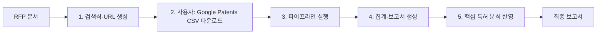

# (2026) 센서 융합 디스플레이 RFP 특허 전략 보고서 작성 절차

**기준 RFP**: `(2026)_RFP_센서_융합_디스플레이_기술.md`  
**Skill**: patent-strategy-report (상관성 점수 파이프라인)

---

## 1. 전체 진행 절차 요약



| 단계 | 담당 | 내용 |
|------|------|------|
| **1** | 에이전트/사용자 | RFP 기반 **검색식·Google Patents URL** 생성 (`generate_query.py`) |
| **2** | **사용자** | 생성된 URL로 **Google Patents에서 검색 후 CSV 다운로드** (v1 원시 데이터) |
| **3** | 에이전트 | v1 CSV + RFP 경로로 **상관성 파이프라인** 실행 (`run_relevance_pipeline.py`) |
| **4** | 에이전트 | 제목 기준 상위 1만 건 집계(연도·출원인·국가) → **보고서 템플릿 채우기** |
| **5** | 에이전트 | 상위 100건 초록 수집 → 초록 점수로 **핵심 특허 상위 10건** 선정·분석 후 보고서에 반영 |

---

## 2. 단계별 상세 절차

### 2.1 검색식·URL 생성 (Step 1)

- **스크립트**: `scripts/generate_query.py`
- **입력**: RFP 마크다운 경로, 기술 도메인(선택), 포함/제외 키워드(선택)
- **출력**: 검색식 문자열 + **Google Patents 검색 URL** (사용자가 이 URL로 접속해 결과 다운로드)

**예시 명령** (센서 융합 디스플레이 RFP 기준):

```bash
cd .codex/skills/patent-strategy-report/scripts
python generate_query.py "c:/Users/JHKIM/Patent_Analysis/(2026)_RFP_센서_융합_디스플레이_기술.md" 디스플레이 --years 15
```

- RFP에서 **형태가변, 변형인식, 센서, 디스플레이, UI/UX** 등 개념을 추출해 `(그룹1 OR ...) AND (그룹2 OR ...)` 형태 검색식 생성.
- 필요 시 `--exclude-terms "OLED,LCD"`, `--required-terms "sensor,display,deformation"` 등으로 조정 가능.

---

### 2.2 사용자 수행: CSV 다운로드 (Step 2)

- 생성된 **Google Patents URL**을 브라우저에서 열기.
- 검색 결과 페이지에서 **CSV 내보내기** 실행 (Google Patents에서 제공하는 "Download" → CSV).
- 다운로드한 CSV 파일을 **워크스페이스 내 경로**에 저장 후, 해당 **파일 경로**를 에이전트에게 전달.

> [!important] 필요 자료 (사용자 제공)
> - **Google Patents에서 내보낸 CSV 파일** (v1 원시 데이터)
> - 파일 경로 예: `c:\Users\JHKIM\Patent_Analysis\data\patents_sensor_display_export.csv` 등

---

### 2.3 상관성 파이프라인 실행 (Step 3)

- **스크립트**: `scripts/run_relevance_pipeline.py`
- **입력**: (1) 사용자가 다운로드한 **v1 CSV 경로**, (2) **RFP 마크다운 경로**, (3) 출력 디렉터리 `-o ../output`
- **옵션**: `--include-terms`, `--exclude-terms`, `--topic 센서융합디스플레이` 등

**동작 요약**:

1. **제목–RFP 상관성 점수** (TF-IDF 코사인 + 포함/제외 가중치) → **상위 10,000건** 저장 (`v1_top10000.csv`).
2. 상위 **100건** 추출 → **초록·대표청구항** 수집 (`fetch_abstracts.py`).
3. **초록+대표청구항** 기준 상관성 점수 → **상위 10건**을 핵심 특허로 저장 (`핵심특허_상위10건_목록.csv`).
4. 10k CSV **집계** (연도별·출원인·국가별) → **보고서 채우기** (`fill_report.py`) → `{YYYYMMDD}_센서융합디스플레이_세계특허현황_분석보고서.md` 생성.

---

### 2.4 집계·보고서 생성 (Step 4)

- 파이프라인 내부에서 자동 수행.
- **연도별·출원인(영문 통일·동일 회사 합산)·국가별(유럽 통합·한글 명칭)** 집계 후 보고서 템플릿에 표·차트·개요 채움.

---

### 2.5 핵심 특허 분석 반영 (Step 5)

- `핵심특허_상위10건_목록.csv`와 수집된 초록/대표청구항을 바탕으로 **핵심 특허 10건 요약·분석** 문서 작성.
- 해당 내용을 최종 보고서의 "핵심 특허 분석" 섹션에 링크 또는 본문으로 반영.

---

## 3. 사용자에게 필요한 자료 요청 정리

| 구분 | 항목 | 설명 |
|------|------|------|
| **필수** | **Google Patents CSV 파일** | Step 1에서 생성된 검색 URL로 Google Patents에서 검색한 뒤, **결과를 CSV로 내보낸 파일**. 파일 경로를 알려주시면 파이프라인 입력으로 사용합니다. |
| **선택** | 포함 키워드 | 반드시 포함하고 싶은 단어(쉼표 구분). 예: `sensor, display, deformation, stretchable` |
| **선택** | 제외 키워드 | 분석에서 제외할 단어/구문. 예: `OLED, LCD` (RFP와 무관한 특정 패널 기술 제외 시) |
| **선택** | 보고서 토픽명 | 최종 보고서 제목에 넣을 한글 토픽. 미지정 시 기본값(예: 센서융합디스플레이) 사용. |

---

## 4. 출력물 (output 디렉터리)

| 파일 | 용도 |
|------|------|
| `v1_top10000.csv` | 제목 기준 상위 1만 건 (통계·보고서 집계용) |
| `핵심특허_상위10건_목록.csv` | 초록 점수 기준 핵심 특허 10건 목록 |
| `aggregate_report_data_10k.json` | 연도/출원인/국가 집계 데이터 |
| `{YYYYMMDD}_센서융합디스플레이_세계특허현황_분석보고서.md` | 최종 Obsidian 형식 특허 전략 보고서 |
| (선택) `핵심특허_상위10건_분석.md` | 핵심 10건 상세 분석 문서 |

---

## 5. 다음 액션

1. **에이전트**: RFP 경로를 기준으로 `generate_query.py`를 실행해 **검색식과 Google Patents URL**을 생성·제시.
2. **사용자**: 해당 URL로 검색 후 **CSV 다운로드** → 다운로드한 **CSV 파일 경로** 전달.
3. **에이전트**: 전달받은 CSV 경로와 RFP 경로로 `run_relevance_pipeline.py` 실행 → 집계·보고서·핵심 특허 분석까지 일괄 수행.

---

*본 절차서는 patent-strategy-report skill의 상관성 점수 파이프라인을 기준으로 작성되었습니다.*
