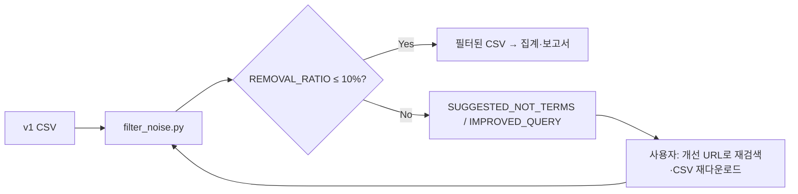

# 현재 스킬의 노이즈 제거 절차

특허 전략 보고서 스킬에서는 **경로 A(노이즈 필터 루프)** 에서 노이즈 제거를 수행한다. 목표는 **제거 비율(REMOVAL_RATIO)이 10% 이하**가 될 때까지 검색식을 보정하며 반복하는 것이다.

---

## 1. 노이즈의 정의

**노이즈**란, RFP의 기술 목표와 **관련성이 낮은 특허**를 말한다.

- 다른 적용 분야·다른 기술 분야이거나
- RFP 핵심 키워드와 제목/초록이 거의 겹치지 않아 **연관성이 낮게 나오는 행**

즉, “검색에는 걸렸지만 RFP 관점에서는 빼고 싶은 특허”를 노이즈로 보고 제거·NOT 후보 도출에 사용한다.

---

## 2. 한 라운드에서 하는 일 (기본: 키워드 기반)

### 2.1 입력

- **CSV**: Google Patents에서 다운로드한 v1 CSV (제목, 선택적으로 초록 등)
- **RFP 경로**: 기술 목표·키워드가 있는 마크다운 파일
- **(선택)** `--current-query`: 이번에 사용한 검색식 (NOT 제안 시 기존 쿼리와 겹치지 않게 하기 위함)

### 2.2 노이즈 판별 (키워드 점수)

- **RFP에서 키워드 추출**: `load_rfp_keywords(rfp_path)`  
  - 영문 키워드, 한글 키워드, RFP명/사업명에서 추출한 용어
- **행별 점수**: 각 특허 행에 대해 **제목 + (있으면) 초록** 텍스트와 RFP 키워드의 **겹침 비율**을 계산  
  - `keyword_score(text, keywords)` = (텍스트에 등장한 키워드 수) / (전체 키워드 수)
- **기준값**: `--threshold` (기본 **0.15**)  
  - **점수 ≥ threshold** → 유지(keep)  
  - **점수 < threshold** → 노이즈(removed)

즉, RFP 키워드와 겹치는 비율이 너무 낮으면 노이즈로 분류한다.

### 2.3 출력

- **필터된 CSV**: 유지된 행만 저장 (기본: 원본 파일명의 `_filtered.csv` 또는 `-o` 로 지정한 경로)
- **REMOVAL_RATIO**: `removed_count / total_count`  
  - 이 값이 **0.10 이하**이면 “노이즈 제거 절차 종료”로 보고 다음 단계(집계·보고서)로 진행한다.

---

## 3. 반복 루프 (REMOVAL_RATIO > 10%일 때)

제거 비율이 **10%를 넘으면** “아직 노이즈가 많다”고 보고, **검색식 보정 제안**을 한다.

### 3.1 NOT 후보 도출

- **대상**: 이번 라운드에서 **제거된 행(노이즈)** 의 제목·초록 텍스트
- **방식**:  
  - 노이즈 행에서 단어(영문, 3글자 이상) 빈도를 구하고  
  - **유지(keep) 행**에서는 상대적으로 적게 나온 단어만 후보로 선택  
  - RFP 키워드·현재 검색식에 이미 들어 있는 단어, stopword(예: method, device, system, sensor 등)는 **제외**
- **결과**: 상위 N개(기본 5개)를 **SUGGESTED_NOT_TERMS** 로 출력

### 3.2 개선 검색식·URL 제안

- **IMPROVED_QUERY_SUGGESTION**:  
  `현재 검색식 + " NOT (term1 OR term2 OR ...)"`  
  (제안된 NOT 후보를 OR로 묶어서 NOT 블록으로 붙임)
- **IMPROVED_SEARCH_URL**: 위 개선 검색식을 반영한 Google Patents URL (파이프라인에서 `--search-query`·`--search-url`을 넘겼을 때 생성)

### 3.3 사용자 액션

1. **IMPROVED_SEARCH_URL**(또는 개선 검색식)로 Google Patents에서 **다시 검색**
2. **새 CSV 다운로드**
3. **같은 노이즈 필터**를 다시 실행  
   - `filter_noise.py <새_CSV> <RFP> -o output/filtered.csv --current-query "개선된_검색식"`
   - 또는 `run_full_pipeline.py` 에 새 CSV·개선된 검색식/URL을 넣고 재실행

### 3.4 종료 조건

- **REMOVAL_RATIO ≤ 10%** 가 되면 노이즈 제거 반복을 멈추고, **현재 필터된 CSV**를 기준으로 집계·보고서 단계로 진행한다.

---

## 4. 대안: 초록 기반 NOT 품질 향상

CSV에 **초록이 없을 때**는 NOT 후보 품질을 높이기 위해 다음 순서를 쓸 수 있다.

1. **초록 크롤링** (`fetch_abstracts.py`): result link로 HTML에서 초록 추출 → `abstract` 컬럼 추가  
2. **초록–RFP 연관성 점수** (`score_relevance.py`): TF-IDF 코사인 유사도로 점수 부여, **threshold 미만**인 행을 노이즈로 분류 (`is_noise` 컬럼)  
3. **노이즈에서 NOT 추출** (`extract_not_from_noise.py`): 노이즈 행의 초록(또는 제목)에서 상대적으로 자주 나온 단어를 NOT 후보로 제안  

한 번에 실행하려면:

```bash
python run_noise_pipeline_with_abstracts.py <input_csv> <rfp_path> --current-query "..." --search-url "..." [-o output_dir] [--skip-fetch]
```

- `--skip-fetch`: 이미 `abstract` 컬럼이 있으면 크롤링 생략

---

## 5. 요약 흐름도



| 단계 | 내용 |
|------|------|
| 1 | v1 CSV + RFP로 `filter_noise.py` 실행 (키워드 점수, threshold 기본 0.15) |
| 2 | REMOVAL_RATIO 계산; 10% 이하이면 종료 후 집계·보고서 |
| 3 | 10% 초과 시 노이즈 행에서 NOT 후보 도출 → IMPROVED_QUERY_SUGGESTION 출력 |
| 4 | 사용자가 개선 검색식/URL로 재검색·재다운로드 후 1번부터 반복 |

---

## 6. 관련 스크립트·옵션

| 스크립트 | 역할 |
|----------|------|
| `filter_noise.py` | 키워드 기반 노이즈 판별, 필터된 CSV 저장, NOT 제안 |
| `run_full_pipeline.py` | 필터 + 집계 + 보고서; REMOVAL_RATIO>10% 시 개선 쿼리 출력 후 집계 전 중단 |
| `score_relevance.py` | 초록–RFP TF-IDF 점수, 노이즈 플래그 부여 |
| `extract_not_from_noise.py` | 노이즈 행에서 NOT 후보 추출 |
| `run_noise_pipeline_with_abstracts.py` | 초록 크롤링 → 점수 → NOT 추출 일괄 실행 |

**filter_noise.py 주요 옵션**

- `--threshold 0.15`: 유지 기준 점수 (이상이면 keep)
- `--current-query "..."`: 현재 검색식 (NOT 제안 시 쿼리와 겹치는 단어 제외)
- `--suggest-top-n 5`: NOT 후보 최대 개수
