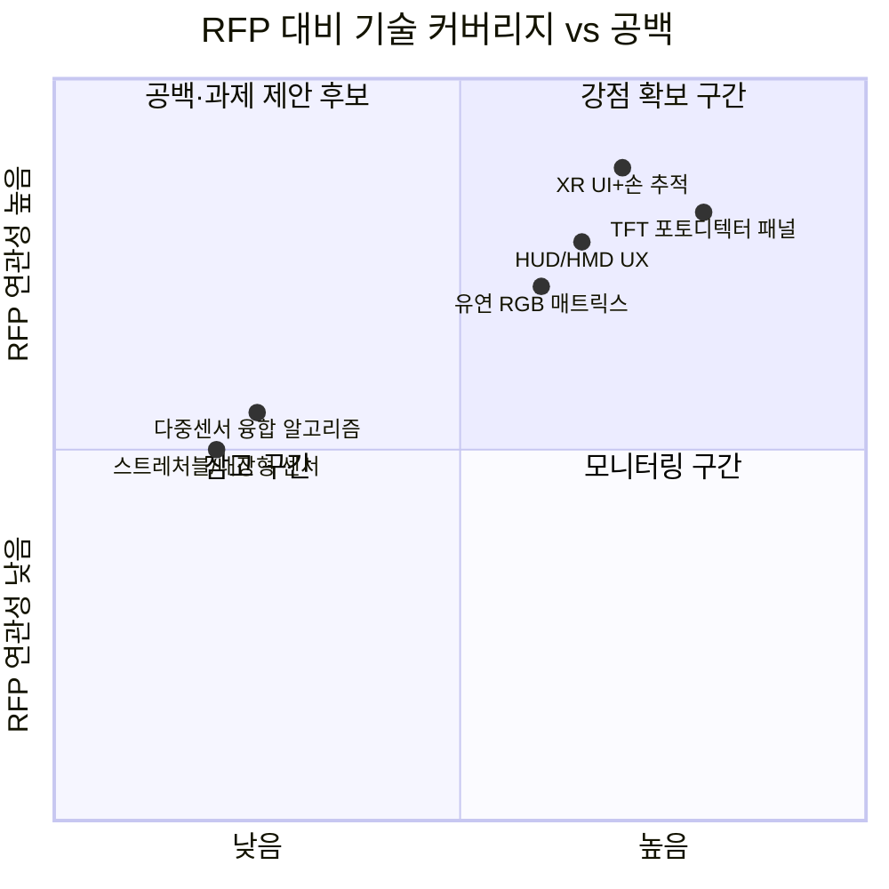

# 핵심 특허 상위 10건 분석

> **선정 기준**: 10,000건 → 상위 500건(초록 수집) → **초록–RFP 연관성** 점수 순 정렬 → **제목·초록에 OLED/LCD 포함된 특허 제외** 후 **상위 10건**  
> **RFP**: 센서 융합 디스플레이 기술  
> **상세 목록**: [핵심특허_상위10건_목록.csv](핵심특허_상위10건_목록.csv)

---

## 1. 핵심 특허 개요

| 순위 | 특허 ID | 출원인 | 연관성 점수 | 핵심 키워드(초록 기반) |
|------|---------|--------|-------------|------------------------|
| 1 | US-12400414-B2 | Meta Platforms | 0.0798 | XR, system UI, 3D virtual element, hand tracking |
| 2 | US-2024053163-A1 | Wayray Ag | 0.0418 | HUD, HMD, AR/VR, UX/UI, turn-by-turn |
| 3 | US-11282415-B2 | Benjamin KAY 등 | 0.0094 | flexible RGB display matrix, LED stanchion ribbon |
| 4 | JP-2025513035-A | E Ink | 0.0084 | color display, RGB, electrophoretic, ACeP |
| 5 | ES-3027947-T3 | Signify | 0.0071 | RGB LED, filament, matrix, CCT |
| 6 | US-2022139972-A1 | Hoon Kim | 0.0032 | TFT photodetector, display panel, flexible substrate |
| 7 | KR-20190104936-A | LG전자 | 0.0017 | 5G, AI/ML, 통화 음질 (디스플레이 직접 연관 낮음) |
| 8 | CN-111542893-B | 爱惜康 | 0.0003 | RGB/레이저, backscatter, surgical display |
| 9 | KR-102759157-B1 | 삼성전자 | 0.0 | 디스플레이 장치, 제어 방법 |
| 10 | KR-20230122929-A | LG전자 | 0.0 | 디스플레이 디바이스, 플렉서블 |

---

## 2. 대표청구항 분석

> **참고**: 대표청구항(독립항) 전문은 각 특허의 **result link**에서 확인할 수 있습니다. 아래는 초록 및 제목 기반 요약입니다.

### 2.1 US-12400414-B2 (Meta, XR UI)
- **요지**: XR 환경에서 시스템 UI를 3D 가상 요소로 렌더링하고, 사용자 손 및 고정점 추적에 기반하여 UI를 잡아 이동·회전시키는 방법.
- **RFP 연관성**: 디스플레이(가상 UI) + 사용자 상호작용(손 추적) → **센서(손/위치) 융합 디스플레이**와 개념적으로 부합.

### 2.2 US-20240053163A1 (Wayray, HUD/HMD)
- **요지**: HUD·HMD·AR/VR용 UX/UI 요소(방향 포인터, 자이로 포인터 등)로 경로 안내 표시.
- **RFP 연관성**: 투사/착용형 디스플레이 + 사용자 경험 → **융합 디스플레이** 활용 사례.

### 2.3 US-11282415-B2 (Flexible RGB display matrix)
- **요지**: 유연 LED 스탠션 리본 디스플레이를 이용한 RGB 매트릭스 배리어 시스템.
- **RFP 연관성**: 유연·RGB 디스플레이 구성 요소 직접 연관.

### 2.4 JP-2025513035A (E Ink, ACeP)
- **요지**: RGB 이미지 데이터를 전기이동 디스플레이(ACeP)용 색상으로 변환하는 프로세서 및 룩업 테이블.
- **RFP 연관성**: 디스플레이 색상 처리·센싱(표시 매체) 연계.

### 2.5 ES-3027947-T3 (Signify, LED filament)
- **요지**: RGB 계열 다중 광원을 매트릭스로 배치한 LED 필라멘트 구조 및 CCT 제어.
- **RFP 연관성**: 광원 배열·색제어 → 디스플레이 백라이트/조명 융합과 연관 가능.

### 2.6 US-20220139972A1 (Hoon Kim, TFT photodetector on panel)
- **요지**: 유리 또는 투명 유연 기판 위에 TFT 포토디텍터를 형성하는 제조 방법(광수신부로서 게이트 활용).
- **RFP 연관성**: **디스플레이 패널 상의 광센서 집적** → 센서 융합 디스플레이의 핵심 구현 형태.

### 2.7 KR-20190104936-A (LG, 통화 음질)
- **요지**: 5G·AI/ML 기반 통화 음질 향상(디스플레이 직접 주제 아님).
- **RFP 연관성**: 낮음. 상위 500건 내 제목/초록 유사도로 진입한 것으로 해석.

### 2.8 CN-111542893-B (RGB/레이저, 수술 영상)
- **요지**: 다중 파장 조명·RGB·레이저와 센서로 백산란 분석, 영상 데이터를 디스플레이 시스템용 포맷으로 제공.
- **RFP 연관성**: RGB·광센서·디스플레이 연계이지만 응용 분야(의료)가 RFP와 다름.

### 2.9 KR-102759157-B1 (삼성전자, 디스플레이 장치)
- **요지**: 디스플레이 장치 및 디스플레이 장치를 제어하는 방법(제어 모듈·센서 데이터 연동).
- **RFP 연관성**: 디스플레이 제어·센서 연동.

### 2.10 KR-20230122929-A (LG전자, 디스플레이 디바이스)
- **요지**: 플렉서블 디스플레이 디바이스, 센서·패널 구조.
- **RFP 연관성**: 디스플레이 디바이스·플렉서블 구조.

---

## 3. 공백 기술 분석 (Technology Gap)

RFP **센서 융합 디스플레이** 관점에서, 핵심 10건이 커버하는 영역과 **공백**을 정리하면 다음과 같다.



### 3.1 잘 커버된 영역
- **디스플레이 위/내부 광센서**: US-20220139972A1 (TFT photodetector on panel) 등. (OLED 기반 광학 터치·생체 인식은 RFP 키워드 제외에 따라 본 핵심 10건에서는 제외하였으나, 선행으로 참고 가능.)
- **XR/가상 UI와 상호작용**: US-12400414-B2 (손 추적 기반 UI 조작).
- **HUD/HMD/AR·VR 디스플레이 UX**: US-20240053163A1.
- **유연·RGB 디스플레이 소자**: US-11282415-B2, JP-2025513035A, ES-3027947-T3.
- **차량용 디스플레이·조명 제어**: (TFT LCD·OLED 특허는 제외 키워드로 선정에서 제외됨.)

### 3.2 공백(과제 제안 시 활용 가능)
1. **스트레처블/신축 디스플레이 + 내장 센서**  
   - 10건 중 스트레처블 소재·구조를 명시한 특허 없음. RFP의 “신축·융합”과 결합한 **스트레처블 디스플레이 위 센서 배열**은 공백으로 볼 수 있음.
2. **다중 센서(터치·광·압력·온도 등) 융합 알고리즘**  
   - 단일 센서(광학 터치, 포토디텍터) 위주. **다중 센서 데이터 융합 및 디스플레이 제어** 연계 특허는 상위 10건에서 상대적으로 부족.
3. **투명/플렉시블 패널 일체형 광·접촉 센서**  
   - TFT 포토디텍터(US-20220139972A1)는 유연 기판을 언급하나, **투명도·투과율과 디스플레이 픽셀 배치**를 동시에 다루는 청구는 제한적.
4. **차량·웨어러블 외 산업용(산업용 HMI, 로봇 인터페이스)**  
   - 차량·HUD/휴대 위주. 산업용 센서 융합 디스플레이 인터페이스는 공백 후보.

---

## 4. OS Matrix 분석 (Opportunity–Strength)

과제 제안 시 **기회(Opportunity)** 와 **강점(Strength)** 을 매트릭스로 정리한다.

| 구분 | 기회(O) | 강점(S) | 전략 방향 |
|------|---------|---------|-----------|
| **기술** | 스트레처블·다중센서 융합, 투명 패널 일체형 센서 | OLED 터치/생체 인식, TFT 포토디텍터 패널, XR UI 상호작용 | 기존 강점(디스플레이 내 광센서, XR UI) 위에 **스트레처블·다중센서·융합 알고리즘**으로 차별화 |
| **출원인** | Meta, Apple, Wayray, LG, E Ink 등 선행 포트폴리오 존재 | 국내·외 특허 다수(삼성·LG·Apple 등) | 선행 특허 회피 설계 + **국내 출원인(LG 등)과의 공백 영역(스트레처블, 산업용)** 에 집중 |
| **지역** | 미국·중국·한국·일본·유럽 출원 분포 | 한국 8.7%(10k 기준), 미국 45.9% | 국내 R&D는 **한국·PCT 병행** 및 미국 시장 대비 청구 범위 설계 |
| **응용** | 차량, HUD/HMD, 의료 영상, 전자종이 | 차량 라이트/램프, 스마트폰 터치/인증, XR | **산업용 HMI·로봇·웨어러블** 등 미포함 응용을 과제 주제로 연결 |

```mermaid
xychart-beta
    title "OS 매트릭스: 기회 vs 강점 (상대적 점수)"
    x-axis [기회 낮음, 기회 중간, 기회 높음]
    y-axis [강점 낮음, 강점 중간, 강점 높음]
    line [0.3, 0.6, 0.85]
```

- **강점 높음·기회 높음**: 디스플레이 내 광센서(TFT/OLED), XR UI → 여기에 **스트레처블·다중센서 융합**을 더하면 과제 차별화 가능.
- **강점 중간·기회 높음**: 스트레처블, 다중센서 융합 알고리즘, 산업용 HMI → **특허 창출 전략**의 핵심 타깃.

---

## 5. 특허 창출 전략 (과제 제안 활용)

RFP **센서 융합 디스플레이**와 상위 10건 분석을 바탕으로 한 제안 방향이다.

### 5.1 회피·우회 설계
- **US-20220139972A1(Hoon Kim)**: TFT 포토디텍터 on panel. 차별화 → **투명 전극 배치**, **디스플레이 픽셀과 센서 픽셀 공간 분할 설계**, **유기 포토디텍터 조합**.
- **US-12400414-B2(Meta)**: XR UI 손 추적. 차별화 → **디스플레이 표면 부착형 압력·근접 센서**와 결합, **비전 전용이 아닌 멀티모달 센서** 강조.
- **선행으로만 참고(핵심 10건 제외)**: OLED 기반 터치/생체(Apple), TFT LCD 차량 라이트(Putco) 등은 제목·초록에 OLED/LCD가 포함되어 본 분석에서는 제외하였음.

### 5.2 공백 기반 창출 포인트
1. **스트레처블 디스플레이 + 내장 다중 센서**  
   - 청구 초안: “신축 가능한 기판 상에 디스플레이 소자와 적어도 두 종류 이상의 센서(광, 압력, 온도 중 2개 이상)를 배열하고, 상기 센서 신호를 융합하여 디스플레이 제어 신호를 생성하는 방법/장치.”
2. **다중 센서 융합 알고리즘**  
   - 청구 초안: “디스플레이 패널 상의 복수 센서 출력을 수신하여 터치·근접·조도 중 2개 이상을 결합하고, 결합 결과에 따라 표시 내용 또는 터치 좌표를 보정하는 처리부를 포함하는 디스플레이 장치.”
3. **투명/플렉시블 패널 일체형 광·접촉 센서**  
   - 청구 초안: “투명 또는 유연 기판 상에 표시 영역과 광감지 영역이 동일 평면에 배치되고, 광감지 영역의 투과율이 표시 영역 대비 90% 이상인 패널 및 이를 포함하는 디스플레이 모듈.”

### 5.3 권리화 우선순위 제안
| 순위 | 기술 영역 | 이유 |
|------|-----------|------|
| 1 | 스트레처블 + 다중 센서 배열·신호 융합 | RFP와 직접 연관, 선행 10건에서 공백 |
| 2 | 디스플레이-센서 공간 배치·투과율 설계 | US-20220139972A1 등과 차별화 가능 |
| 3 | 다중 센서 융합에 의한 터치/표시 보정 | Apple·Meta 선행과 다른 시스템 레벨 청구 |
| 4 | 산업용 HMI·로봇 인터페이스 적용 | 응용 분야 공백 |

---

## 6. 정합성 요약

- **10,000건 통계**: 연도별·출원인·국가별 집계는 본 보고서의 **20260307_센서융합디스플레이_10000건_세계특허현황_분석보고서.md**와 동일 데이터(v1_top10000.csv) 기준으로 일치한다.
- **500건**: 초록 수집 후 초록–RFP 연관성으로 재점수 부여·정렬한 **top500_abstract_scored.csv**를 사용하였다.
- **핵심 10건**: 위 500건 중 **relevance_score 상위 10건**을 선정하였으며, 동일 목록이 **핵심특허_상위10건_목록.csv**에 저장되어 있다.
- **용어 통일**: “센서 융합 디스플레이”, “RFP”, “연관성 점수(초록–RFP)”는 메인 보고서와 이 문서에서 동일한 의미로 사용하였다.

---

*본 분석은 [[20260307_센서융합디스플레이_10000건_세계특허현황_분석보고서]] 제7절에서 요약·링크되며, 과제 제안 시 특허 창출 전략 수립에 활용할 수 있습니다.*
