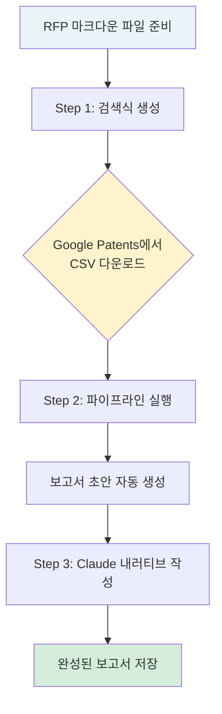
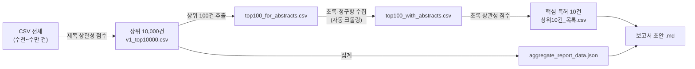

# 특허 전략 보고서 스킬 사용 매뉴얼

> [!note] 이 문서는?
> `patent-strategy-report` 스킬을 **처음 사용하는 분**을 위한 단계별 사용 가이드입니다.
> RFP(연구 제안서) 마크다운 파일과 Google Patents CSV 파일만 있으면, Claude가 자동으로 특허 전략 보고서를 만들어 줍니다.

---

## 1. 스킬 개요

### 무엇을 해주나요?

이 스킬은 다음 두 가지 파일을 입력받아 **특허 전략 보고서(Obsidian 마크다운)**를 자동 생성합니다.

| 입력 | 설명 |
|------|------|
| **RFP 마크다운 파일** | 연구 목표·기술 키워드가 담긴 `.md` 파일 |
| **Google Patents CSV** | Google Patents에서 직접 내려받은 특허 검색 결과 |

### 어떤 보고서가 나오나요?

```
YYYYMMDD_<기술분야>_세계특허현황_분석보고서.md
```

보고서에는 다음 내용이 포함됩니다.

- 연도별·국가별·출원인별 특허 동향 (통계 + 차트)
- 주요 출원인 전략 분석 표
- 핵심 특허 10건 (청구항 요지, 기술 공백 분석)
- OS 매트릭스 (기술 영역 × 주요 출원인)
- 종합 시사점 및 R&D 제언

---

## 2. GitHub에서 설치하기 (최초 1회)

> [!note] 이미 스킬이 설치되어 있다면?
> `C:/Users/JHKIM/my-tools/skills/patent-strategy-report/scripts/` 폴더가 존재하면 이 섹션을 건너뛰고 **§2 사전 준비**부터 시작합니다.

스킬 파일은 GitHub 저장소 [nanomechanicsKIMM/my-tools](https://github.com/nanomechanicsKIMM/my-tools)에 있습니다.
`skills/patent-strategy-report/` 폴더 전체가 포함되어 있습니다.

### 2-1. Git 설치 확인

터미널(PowerShell 또는 명령 프롬프트)을 열고 아래 명령으로 Git이 설치되어 있는지 확인합니다.

```powershell
git --version
```

> [!tip] Git이 없다면?
> [https://git-scm.com/download/win](https://git-scm.com/download/win) 에서 내려받아 설치하세요.

### 2-2. 저장소 클론 (다운로드)

원하는 위치에 저장소를 클론합니다. 아래는 `C:/Users/JHKIM/` 아래에 받는 예시입니다.

```powershell
cd C:/Users/JHKIM
git clone https://github.com/nanomechanicsKIMM/my-tools.git
```

클론이 완료되면 다음 구조가 생성됩니다.

```
C:/Users/JHKIM/my-tools/
├── skills/
│   └── patent-strategy-report/   ← 스킬 본체
├── setup.ps1                      ← Windows 자동 설치 스크립트
├── setup.sh                       ← Mac/Linux 자동 설치 스크립트
└── README.md
```

### 2-3. 스킬 배포 (setup 스크립트 실행)

setup 스크립트를 실행하면 스킬 파일이 **Claude Code(Codex)가 인식하는 위치**로 자동 복사됩니다.

**Windows (PowerShell)**

```powershell
cd C:/Users/JHKIM/my-tools
.\setup.ps1
```

**Mac / Linux (터미널)**

```bash
cd ~/my-tools
chmod +x setup.sh
./setup.sh
```

> [!info] setup 스크립트가 하는 일
> `skills/` 폴더 안의 모든 스킬을 아래 경로로 복사합니다.
> - **기본 경로**: `%USERPROFILE%\.claude\skills\` (Windows) / `~/.claude/skills/` (Mac/Linux)
> - 환경변수 `CODEX_HOME`이 설정되어 있으면 `$CODEX_HOME/skills/`를 사용합니다.
> - 기존 스킬이 있으면 덮어씁니다 (최신 버전으로 업데이트).

복사 완료 후 **Claude Code를 재시작**하면 스킬이 인식됩니다.

> [!warning] setup 없이 수동으로 쓰려면?
> setup 스크립트 없이 클론한 폴더를 그대로 사용할 수도 있습니다.
> 이 경우 스크립트 경로를 `C:/Users/JHKIM/my-tools/skills/patent-strategy-report/scripts/`로 직접 지정하면 됩니다.

### 2-4. 업데이트 방법

저장소에 새 버전이 올라오면 아래 명령으로 당겨받고, setup을 다시 실행합니다.

```powershell
cd C:/Users/JHKIM/my-tools
git pull
.\setup.ps1
```

---

## 3. 사전 준비 (최초 1회)

> [!warning] 이 설정은 스킬을 처음 쓸 때 한 번만 하면 됩니다.

### 3-1. Python 패키지 설치

터미널(명령 프롬프트 또는 PowerShell)에서 아래 명령을 실행합니다.

```powershell
cd C:/Users/JHKIM/my-tools/skills/patent-strategy-report/scripts
uv venv
uv pip install -r requirements.txt
```

> [!tip] `uv`가 없다면?
> ```powershell
> pip install uv
> ```
> 위 명령으로 먼저 설치한 후 다시 시도하세요.

**설치되는 주요 패키지**

| 패키지 | 용도 |
|--------|------|
| `pandas` | CSV 파일 처리 |
| `scikit-learn` | TF-IDF 상관성 점수 계산 |
| `requests` + `beautifulsoup4` | 특허 초록 자동 수집 |

### 3-2. RFP 마크다운 파일 준비

분석하려는 기술의 연구 목표, 필요 기술, 키워드가 담긴 마크다운(`.md`) 파일을 준비합니다.

> [!example] RFP 파일 예시 (일부)
> ```markdown
> # 신축성 디스플레이 센서 융합 기술 개발
>
> ## 연구 목표
> 스트레처블 기판 위에 디스플레이와 압력/변형 센서를 통합하여...
>
> ## 핵심 키워드
> stretchable, deformable, flexible display, sensor, strain sensing
> ```

---

## 4. 전체 흐름 한눈에 보기



**소요 시간 기준**

| 단계 | 소요 시간 |
|------|-----------|
| 검색식 생성 | 1분 미만 |
| Google Patents CSV 다운로드 | 1~5분 (수동) |
| 파이프라인 실행 | 5~15분 (초록 수집 포함) |
| 보고서 내러티브 작성 | Claude가 자동 처리 |

---

## 5. Step 0 – 입력 정보 확인

Claude에게 다음 정보를 알려줍니다. **굵은 항목은 필수, 나머지는 선택사항입니다.**

| 항목 | 설명 | 예시 |
|------|------|------|
| **RFP 파일 경로** | 분석 대상 RFP 마크다운 파일 | `C:/Users/JHKIM/patent_b/RFP_신축디스플레이.md` |
| **CSV 파일 경로** | Google Patents에서 받은 CSV | `C:/Users/JHKIM/patent_b/patents.csv` |
| 제외 키워드 | 검색에서 뺄 단어 | `OLED,LCD,AR,VR` |
| 필수 포함 키워드 | 반드시 포함될 단어 | `stretchable display` |
| 검색 기간 | 기본 10년 | `--years 15` |

> [!tip] CSV 파일이 아직 없어도 됩니다
> CSV가 없으면 Step 1(검색식 생성)부터 진행합니다.
> Claude가 검색식과 Google Patents URL을 만들어주면, 그 URL에서 CSV를 내려받으면 됩니다.

---

## 6. Step 1 – 검색식 생성 및 CSV 다운로드

### 5-1. 검색식 자동 생성

Claude가 다음 명령을 실행합니다.

```bash
PYTHONUTF8=1 python "C:/Users/JHKIM/my-tools/skills/patent-strategy-report/scripts/generate_query.py" \
  "<RFP 파일 경로>" \
  [--exclude-terms "OLED,LCD"] \
  [--required-terms "stretchable display"] \
  [--years 15]
```

**생성 결과 예시**

```
검색식:
(stretchable OR deformable OR flexible) AND (display OR panel OR screen) AND (sensor OR sensing OR strain)
NOT ("OLED" OR "LCD")

Google Patents URL:
https://patents.google.com/?q=...&after=priority:20110101&before=priority:20251231
```

> [!warning] 검색식 확인 포인트
> - 결과가 **10,000건 초과**하면 검색식이 너무 넓은 것입니다. `--exclude-terms`나 `--required-terms`로 범위를 좁혀주세요.
> - `experience`, `user`, `interface` 같은 **일반적인 단어**가 포함되어 있으면 노이즈가 많아집니다. 제외 키워드에 추가하세요.

### 5-2. Google Patents에서 CSV 내려받기

1. Claude가 제공한 **URL을 브라우저 주소창에 붙여넣어** 엽니다
2. 검색 결과 페이지 상단의 **"Download (CSV)"** 버튼을 클릭합니다
3. 파일이 다운로드되면 원하는 경로에 저장합니다

> [!note] CSV 건수 기준
> - **10,000건 미만**: 그대로 사용합니다
> - **10,000건**: 최대치에 걸렸다는 뜻으로, 검색식을 더 좁히는 것을 검토합니다
> - Google Patents는 한 번에 최대 **1,000건** CSV를 내려받을 수 있습니다
>   (결과가 많으면 여러 번 나눠 받거나, 검색식을 좁혀 1,000건 이내로 맞추세요)

---

## 7. Step 2 – 파이프라인 일괄 실행

CSV 파일이 준비되면 Claude가 아래 명령으로 **전체 파이프라인을 한 번에 실행**합니다.

```bash
PYTHONUTF8=1 python "C:/Users/JHKIM/my-tools/skills/patent-strategy-report/scripts/run_relevance_pipeline.py" \
  "<CSV 파일 경로>" "<RFP 파일 경로>" \
  -o "<출력 폴더 경로>" \
  [--include-terms "sensor,deformation,flexible"] \
  [--exclude-terms "OLED,LCD,AR,VR"]
```

### 파이프라인 내부 진행 순서



### 생성되는 출력 파일

| 파일명 | 내용 |
|--------|------|
| `v1_top10000.csv` | 제목 기준 상관성 상위 10,000건 (통계용) |
| `top100_for_abstracts.csv` | 상위 100건 (초록 수집 대상) |
| `top100_with_abstracts.csv` | 초록·대표청구항이 추가된 100건 |
| `top100_abstract_scored.csv` | 초록+청구항 기준 점수가 매겨진 100건 |
| `핵심특허_상위10건_목록.csv` | 최종 핵심 특허 10건 |
| `aggregate_report_data_10k.json` | 연도·국가·출원인 집계 데이터 |
| `YYYYMMDD_<기술분야>_...보고서.md` | 보고서 초안 |

> [!tip] 상관성 점수란?
> RFP 본문과 특허 제목(또는 초록)을 **TF-IDF 코사인 유사도**로 비교한 값입니다.
> 점수가 높을수록 RFP 기술과 관련성이 높은 특허입니다.
> 포함 키워드가 있으면 점수를 올리고, 제외 키워드가 있으면 점수를 내립니다.

---

## 8. Step 3 – 보고서 내러티브 작성

파이프라인 실행 후 Claude가 자동으로 다음 섹션을 작성합니다.

| 섹션 | 내용 |
|------|------|
| **§1 개요** | 검색 조건, 총 건수, 기술 발전 단계 판단 |
| **§2.3 해석** | 최근 출원 감소 원인 분석 (공개 지연 vs 기술 성숙) |
| **§3.3 주요 출원인 전략** | 표 형식으로 상위 10개 출원인 분석 |
| **§4.2 국가별 전략** | 상위 5개국 특성 및 R&D 과제 연관성 |
| **§5 종합 시사점** | 기술 발전 단계, IP 경쟁 구도, R&D 시사점 |
| **§6 핵심 특허** | 개요 표, 대표청구항 요지, 기술 공백, OS 매트릭스 |

> [!note] §3.3 출원인 분석 표 예시
> | 출원인 | 강점·주요 포트폴리오 | RFP 연관성 | 차별화·선행 회피 포인트 |
> |--------|---------------------|-----------|------------------------|
> | Samsung Display (124) | 플렉서블 OLED 다수 | 중 | 신축성 기판 구조 차별화 |
> | BOE Technology (98) | 양산 기반 폴더블 | 중 | 센서 통합 접근 차별화 |
> | ... | ... | ... | ... |

---

## 9. 고급 옵션 – 개별 단계 재실행

특정 단계만 다시 실행하고 싶을 때 아래 명령을 사용합니다.

| 목적 | 명령 |
|------|------|
| 검색식만 다시 생성 | `python generate_query.py <rfp> [--exclude-terms ...] [--years N]` |
| 제목 점수만 다시 계산 | `python score_title_relevance.py <csv> <rfp> -o <output_dir>` |
| 초록 수집만 | `python fetch_abstracts.py <top100_csv> -o <output_dir>` |
| 초록 점수만 | `python score_abstract_relevance.py <abstracts_csv> <rfp> -o <output_dir>` |
| 집계만 | `python aggregate_csv_report.py <v1_top10000.csv> --output-dir <output_dir>` |
| 보고서 채우기만 | `python fill_report.py <output_dir>/aggregate_report_data.json --rfp <rfp>` |

> [!warning] 집계 스크립트 주의
> `aggregate_csv_report.py`를 단독 실행할 때는 반드시 `--output-dir`에 **절대 경로**를 지정하세요.
> 절대 경로를 생략하면 파일이 스크립트 폴더에 생성됩니다.

---

## 10. 출원인 이름 정규화

보고서에 한자·한국어 출원인명이 그대로 나오는 경우, 아래 절차로 영문 통일명으로 바꿀 수 있습니다.

1. `scripts/aggregate_csv_report.py`를 열고 `CANONICAL_APPLICANT_EN` 딕셔너리에 항목 추가
   ```python
   "삼성디스플레이": "Samsung Display",
   "三星显示有限公司": "Samsung Display",
   ```
2. 집계 재실행
   ```bash
   python aggregate_csv_report.py output/v1_top10000.csv --output-dir output/
   ```
3. 보고서 §3.1·§3.2·§3.3 수동 업데이트

**현재 등록된 주요 기업 (기본 제공)**

Samsung Display, Samsung Electronics, LG Display, LG Electronics, BOE Technology Group, NHK, Govisionox, OPPO, Tianma Microelectronics, Visionox, Innolux, AU Optronics, Sharp, Japan Display, TCL CSOT, Huawei Technologies, Apple, Google, Seoul National University, KAIST, POSTECH, ETRI

---

## 11. 자주 묻는 질문 (FAQ)

> [!faq] Q. RFP 파일이 없으면 어떻게 하나요?
> 연구 목표와 핵심 기술을 담은 마크다운 파일을 직접 작성하세요. 제목·목표·기술 키워드만 있어도 충분합니다.

> [!faq] Q. CSV 다운로드가 최대 1,000건인데 충분한가요?
> 1,000건도 제목 상관성 필터를 거치면 핵심 특허를 잘 추릴 수 있습니다. 건수가 더 필요하면 검색식을 여러 개로 나눠 CSV를 여러 번 내려받아 합쳐서 사용하세요.

> [!faq] Q. 초록 수집(fetch_abstracts) 단계가 너무 오래 걸려요.
> Google Patents 서버 부하 방지를 위해 요청 간 1초 대기가 기본 설정입니다.
> `--fetch-delay 0.5`처럼 줄일 수 있지만, 너무 빠르게 요청하면 차단될 수 있습니다.
> 이미 초록이 있는 CSV라면 `--skip-fetch` 옵션으로 건너뜁니다.

> [!faq] Q. "OLED", "LCD" 특허가 보고서에 계속 나와요.
> 검색식 생성 시 `--exclude-terms "OLED,LCD"`를 추가하고, 파이프라인 실행 시에도 동일하게 `--exclude-terms "OLED,LCD"`를 넣으세요. 두 단계 모두 적용해야 완전히 제거됩니다.

> [!faq] Q. 출력 보고서 파일이 어디에 저장되나요?
> 파이프라인 실행 시 `-o` 옵션으로 지정한 폴더에 저장됩니다.
> 기본적으로 현재 작업 디렉터리의 `output/` 폴더입니다.

---

## 12. 파일 구조 참고

```
patent-strategy-report/
├── scripts/                        ← Python 스크립트 모음
│   ├── generate_query.py           ← 검색식 생성
│   ├── run_relevance_pipeline.py   ← 전체 파이프라인 (권장)
│   ├── score_title_relevance.py    ← 제목 상관성 점수
│   ├── fetch_abstracts.py          ← 초록·청구항 크롤링
│   ├── score_abstract_relevance.py ← 초록 상관성 점수
│   ├── aggregate_csv_report.py     ← 통계 집계
│   ├── fill_report.py              ← 보고서 초안 생성
│   └── requirements.txt            ← 패키지 목록
├── templates/
│   └── report-template.md          ← 보고서 템플릿
├── output/                         ← 실행 결과물 저장 위치
├── reference.md                    ← 상세 기술 레퍼런스
└── 특허전략보고서_스킬_사용매뉴얼.md  ← 이 파일
```

---

## 13. 빠른 시작 체크리스트

- [ ] `git clone https://github.com/nanomechanicsKIMM/my-tools.git` 실행
- [ ] `setup.ps1` (Windows) 또는 `setup.sh` (Mac/Linux) 실행
- [ ] Claude Code 재시작
- [ ] Python 패키지 설치 완료 (`uv pip install -r requirements.txt`)
- [ ] RFP 마크다운 파일 준비
- [ ] Claude에게 "특허 전략 보고서 만들어줘" + RFP 파일 경로 전달
- [ ] 검색식 확인 및 제외/포함 키워드 조정
- [ ] Google Patents에서 CSV 다운로드
- [ ] Claude에게 CSV 경로 전달 → 파이프라인 자동 실행
- [ ] 완성된 보고서 Obsidian에서 확인

---

*이 스킬에 대한 상세 기술 레퍼런스는 [[reference]] 를 참고하세요.*
*보고서 템플릿 구조는 [[templates/report-template]] 을 참고하세요.*
