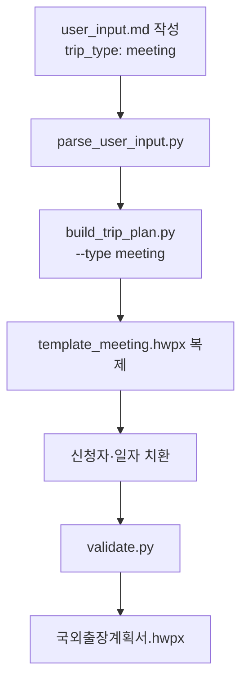
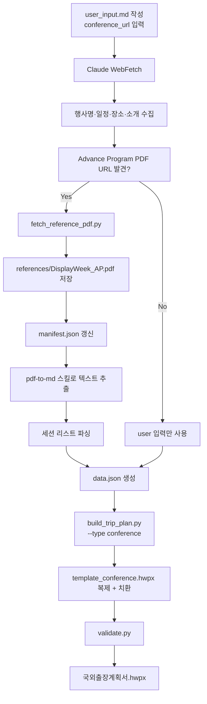

# 국외출장계획서 자동 생성 스킬

> 한국기계연구원 국외출장계획서(HWPX) 양식을 자동 생성한다. 두 가지 양식을 지원한다:
> - **meeting** — 기관방문·회담형 (원장/임원 출장, 동행자·일자별 일정 중심)
> - **conference** — 학회·전시회형 (연구원 출장, 프로그램 개요·세션 중심)

## ⚡ Quick Start

```bash
# 1. 작업 디렉터리에 user_input.md 양식 복사
cp ~/.claude/skills/overseas-trip-plan/assets/user_input_template.md ./user_input.md

# 2. user_input.md 편집 (frontmatter + 섹션)
#    trip_type: conference
#    conference_url: "https://www.displayweek.org/"

# 3. (conference 모드) 학회 Advance Program PDF 다운로드
PYTHONUTF8=1 uv run python ~/.claude/skills/overseas-trip-plan/scripts/fetch_reference_pdf.py \
  --url "https://www.displayweek.org/files/advance_program.pdf" \
  --output-dir references/

# 4. (Claude가 WebFetch로 학회 정보 자동 수집)

# 5. 출장계획서 생성
PYTHONUTF8=1 uv run python ~/.claude/skills/overseas-trip-plan/scripts/build_trip_plan.py \
  --input user_input.md --output 국외출장계획서.hwpx
```

## 📂 스킬 구조

```
~/.claude/skills/overseas-trip-plan/
├── SKILL.md
├── assets/
│   ├── template_meeting.hwpx           # 기관방문 양식 (원장 출장 base)
│   ├── template_conference.hwpx        # 학회 양식 (연구원 출장 base)
│   ├── user_input_template.md          # 사용자 입력 양식 (복사해서 사용)
│   └── placeholder_maps/
│       ├── meeting.json                # Template A 플레이스홀더 맵
│       └── conference.json             # Template B 플레이스홀더 맵
├── scripts/
│   ├── build_trip_plan.py              # 메인 엔트리 포인트
│   ├── parse_user_input.py             # user_input.md → dict 파서
│   ├── zip_replace.py                  # ZIP-level 텍스트 치환 (v0.1)
│   ├── table_utils.py                  # lxml 기반 구조 편집 (v0.2) ⭐
│   ├── fetch_reference_pdf.py          # Advance Program PDF 다운로드
│   ├── validate.py                     # HWPX 구조 검증
│   ├── requirements.txt
│   └── office/
│       ├── unpack.py                   # HWPX → 디렉터리
│       └── pack.py                     # 디렉터리 → HWPX
├── references/
│   ├── placeholder_map.md              # 플레이스홀더 맵 문서
│   └── hwpx_lxml_editing_patterns.md   # lxml 편집 패턴 교훈 (v0.2) ⭐
└── examples/
    └── README.md
```

## 🔧 의존성 설치

```bash
# uv 사용 (권장)
uv pip install PyYAML lxml

# pip 사용
pip install PyYAML lxml --break-system-packages
```

> **Windows**: 모든 실행 시 `PYTHONUTF8=1` 환경변수 필수 (CP949 인코딩 우회).

## 📝 워크플로우

### A. 기관방문(meeting) 모드



### B. 학회(conference) 모드 — WebFetch + PDF 참고자료 포함



## 🧩 주요 스크립트

### `parse_user_input.py`
마크다운 frontmatter + 섹션을 파싱하여 딕셔너리로 반환.

```bash
PYTHONUTF8=1 uv run python scripts/parse_user_input.py --input user_input.md --output data.json
```

- **frontmatter**: YAML로 파싱 (`PyYAML`)
- **섹션 인식**: `## 1.`, `## 2.` … 헤더 기준
- **key-value 표**: `| 항목 | 값 |` 형식
- **불릿 리스트**: `- 항목` 형식
- **placeholder 필터**: `예: ...` 로 시작하는 값은 빈 값으로 간주

### `build_trip_plan.py` (메인 엔트리)

```bash
PYTHONUTF8=1 uv run python scripts/build_trip_plan.py \
  --input user_input.md \
  --output 국외출장계획서.hwpx \
  [--type meeting|conference|auto] \
  [--pdf-ref references/DisplayWeek_AP.pdf]
```

**동작 단계**:
1. `parse_user_input.py` 호출 → 딕셔너리 획득
2. `frontmatter.trip_type` 로 템플릿 선택
3. `assets/placeholder_maps/{type}.json` 로드 → 필드→플레이스홀더 매핑
4. `zip_replace.py` 로 HWPX 내부 XML 일괄 치환
5. `validate.py` 로 구조 검증

### `fetch_reference_pdf.py`

```bash
PYTHONUTF8=1 uv run python scripts/fetch_reference_pdf.py \
  --url "<PDF URL>" \
  --output-dir references/ \
  [--filename custom_name.pdf]
```

**동작**:
1. URL → PDF 다운로드 (`urllib`, 30초 타임아웃)
2. SHA256 체크섬 계산
3. `references/manifest.json` 에 레코드 추가 (append-only)
4. 중복 다운로드 시 체크섬 비교로 변경 감지

**manifest.json 구조**:
```json
{
  "references": [
    {
      "filename": "DisplayWeek2026_AdvanceProgram.pdf",
      "url": "https://...",
      "sha256": "a1b2c3...",
      "size_bytes": 5242880,
      "downloaded_at": "2026-04-11T10:30:00"
    }
  ]
}
```

### `zip_replace.py`
HWPX ZIP 파일 내 모든 XML/RDF/HPF 파트에서 텍스트 치환. 이미지·바이너리는 무손실 복사.

### `validate.py`
- `zipfile.is_zipfile()` 무결성
- 필수 파트 존재 (`mimetype`, `Contents/section0.xml`, `META-INF/manifest.xml`, …)
- `mimetype` 내용 검사 (`hwp` 포함)
- `section0.xml` well-formed 검증

### `table_utils.py` (v0.2) ⭐

lxml 기반 HWPX 구조 편집 유틸리티. 모든 편집 함수가 5가지 핵심 규칙(phantom paragraph 방지 / linesegarray 제거 / rowCnt·rowAddr 재번호 / HWP 호환 XML 선언 / 빈 셀 주입)을 내부에서 자동 처리.

```python
from table_utils import (
    hp,                      # HP 네임스페이스 tag helper
    set_p_text_flow,         # 문단 텍스트 교체 + linesegarray 제거
    set_cell_text_flow,      # 셀 텍스트 교체 (단일 줄, phantom 방지)
    set_cell_text_lines,     # 셀 텍스트 교체 (2~3줄 등 멀티라인)
    remove_paragraph,        # 빈 문단 DOM 완전 삭제
    strip_linesegarray,      # linesegarray 제거 (HWP 재계산 유도)
    find_table_by_anchor,    # 앵커 문자열로 <hp:tbl> 탐색
    renumber_table,          # rowCnt + cellAddr rowAddr 재부여
    insert_row_clone,        # 행 복제 + 삽입
    remove_row_safe,         # 행 삭제 + 병합 rowSpan 감소
    get_rowspan, set_rowspan,
    cell_text, element_text,
    write_hwpx_xml,          # HWP 호환 double-quote XML 선언 저장
)
```

**단일 줄 셀 편집**:
```python
set_cell_text_flow(cell, "Emissive Track")
# - 여분 <hp:p> 제거 (phantom 방지)
# - <hp:linesegarray> 제거 (HWP 재계산)
# - 빈 <hp:t> 셀도 지원 (_set_text_in_p 내부 주입)
```

**멀티라인 셀 편집 (발표제목 2~3개 등)**:
```python
set_cell_text_lines(cell, [
    "Perovskites: Challenges and Opportunities",
    "High-Efficiency Electroluminescent Perovskites",
    "Lead-Free Perovskite Derivatives for Display",
])
# - 각 줄을 별도 <hp:p> 로 배치
# - 첫 <hp:p> 템플릿을 deepcopy 하여 각 줄에 재사용
# - 모든 <hp:p> 에서 linesegarray 제거
```

**행 삽입 + 자동 재번호**:
```python
tbl = find_table_by_anchor(root, ["최근 3년간 국외출장 실적"])
reference_row = tbl.findall(hp("tr"))[3]

def modify_new_row(new_cells):
    set_cell_text_flow(new_cells[0], "2025.05.11 ~ 2025.05.22")
    set_cell_text_flow(new_cells[1], "미국 (로스앤젤레스)")
    set_cell_text_flow(new_cells[2], "SID Display Week 2025 참석")

insert_row_clone(reference_row, insert_after=True, cell_modifier=modify_new_row)
renumber_table(tbl)  # 필수 — rowCnt + rowAddr 재부여
```

**XML 저장**:
```python
write_hwpx_xml(tree, sec_path)
# → <?xml version="1.0" encoding="UTF-8" standalone="yes" ?>... (HWP 호환)
```

자세한 편집 패턴과 함정은 [references/hwpx_lxml_editing_patterns.md](references/hwpx_lxml_editing_patterns.md) 참조.

### v0.3 대량 편집 helper ⭐

이전 연도 템플릿을 당해 출장계획서로 재작성할 때 자주 쓰는 구조적 편집을 위해
`table_utils.py` 에 다음 helper 추가:

| 함수 | 용도 |
|------|------|
| `set_multi_run_text(p, texts)` | 다중 `<hp:run>` paragraph 의 각 `<hp:t>` 를 서식 보존하며 교체 |
| `find_paragraph_by_text(root, needle)` | 텍스트 포함 `<hp:p>` 탐색 |
| `find_table_after(heading_p)` | heading 이후 첫 `<hp:tbl>` |
| `delete_range_between(root, start, end)` | 두 anchor paragraph 사이(start 포함 ~ end 직전) DOM 통째 삭제 — Meta/Apple 블록 제거 등 |
| `rebuild_table_data_rows(tbl, rows)` | 헤더 유지, data rows 전면 재작성 (스케줄·예산·과제 연결 공통) |
| `delete_column(tbl, col_index)` | 반출 장비 테이블 등에서 출장자 컬럼 DOM 제거 + colAddr/colCnt 보정 |
| `find_column_by_header(tbl, header)` | 헤더 텍스트로 `colAddr` 탐색 |

진단 도구:
- `scripts/scan_tables.py <section0.xml>` — 테이블 전체 인덱스·행/열·앵커 출력
- `scripts/dump_tables.py <section0.xml> <idx>...` — 지정 테이블 셀 내용 dump

상세 사용 예시는 [references/bulk_table_editing.md](references/bulk_table_editing.md) 참조.

**WebFetch SSL 차단 우회**: 일부 학회 사이트(`displayweek.org` 등)는 중간 인증서
체인 문제로 Claude WebFetch 가 실패한다. Git Bash 에서 `curl -sSLk` 로 우회:
```bash
curl -sSLk --max-time 20 "https://www.displayweek.org/" -o /tmp/dw.html
```
상세는 `references/bulk_table_editing.md` §7 참조.

## 🎯 user_input.md 작성 가이드

### Frontmatter 필수 필드

```yaml
---
trip_type: conference              # meeting | conference | auto
conference_url: "https://..."      # conference 모드 필수
program_urls:                      # 선택
  - "https://.../program"
output_filename: "출장계획서.hwpx"
---
```

### 섹션 구조 (14개)
1. 신청자 정보 ⭐
2. 출장 개요 ⭐
3. 출장 목적 ⭐
4. 학회·행사 정보 (conference)
5. 기관별 방문 상세 (meeting)
6. 출장자·동행자 ⭐
7. 세부 일정 ⭐
8. 출장자별 연구과제 연결
9. 최근 3년 실적
10. 출장 예산 ⭐
11. 반출 장비
12. 기대효과
13. 기타 메모

⭐ = 최소 동작에 필요한 필수 섹션.

## 🌐 WebFetch 자동 수집 (conference 전용)

Claude가 `conference_url`로부터 다음을 자동 채운다:

| 필드 | 소스 |
|------|------|
| 행사명 / 부제 | `<title>` / `<h1>` |
| 개최 기간 / 장소 | 홈 페이지 상단 |
| 행사 소개 | About / Why Attend 페이지 |
| 규모 통계 | 참가자·논문·트랙 수 |
| 프로그램 구성 | 메뉴·프로그램 구조 |
| 주요 스폰서 | 스폰서 섹션 |

**JS 렌더링 차단 시 graceful degrade**:
1. Advance Program PDF URL을 사용자에게 요청
2. `fetch_reference_pdf.py` 로 다운로드 → `references/`
3. `pdf-to-md` 스킬로 텍스트 변환
4. 세션 리스트 파싱 → `program_overview` 필드 자동 완성

## ⚠️ 주의사항

### ZIP-level 치환의 한계 (v0.1)
- `zip_replace.py` 는 **ZIP-level 텍스트 치환** 방식이므로, 플레이스홀더 문자열이 본문 여러 곳에 나타나면 모두 치환된다.
- 신청자 헤더 / 제출일자 / 출장 기본 정보 까지 자동화.

### lxml 기반 구조 편집 (v0.2 — `table_utils.py`)
- `table_utils.py` 제공: 문단 텍스트 교체, 표 행 복제/삭제, rowCnt/rowAddr 자동 갱신.
- **HWPX 편집 시 반드시 지켜야 할 규칙** (이 세션의 디버깅 교훈):

#### 규칙 1: Phantom paragraph 방지
셀 내 다중 `<hp:p>` 가 있을 때(예: "미국" + "(보스톤, 워싱턴DC)" 2-line 셀), 첫 번째에만 텍스트를 설정하고 나머지를 비우면 **빈 <hp:p> 가 linesegarray 를 가진 채 남아** 한글이 파일 로드를 거부한다.

✅ **올바른 처리**: 여분의 `<hp:p>` 는 **DOM 에서 완전히 삭제**.
```python
set_cell_text_flow(cell, text)   # table_utils 함수 사용
```

#### 규칙 2: linesegarray 완전 제거 (편집한 문단·셀만)
기존 `<hp:linesegarray>` 는 원본 텍스트의 `textpos/horzpos/horzsize` 를 가리킨다. 텍스트를 바꾸면 HWP 가 **원본 위치 메타데이터로 새 텍스트를 렌더**하여 인접 문단과 **겹침(overlap)** 발생.

✅ **올바른 처리**: 편집한 `<hp:p>` 의 `<hp:linesegarray>` 를 완전히 제거 → HWP 가 로드 시 자동 재계산.
```python
strip_linesegarray(p)            # table_utils 함수 사용
```

> tor 스킬이 생성하는 `<hp:p>` 에도 `<hp:linesegarray>` 가 없다 — 같은 패턴.

#### 규칙 3: rowCnt + rowAddr 재번호 (행 삽입·삭제 후 필수)
행 추가·삭제 시 다음을 반드시 갱신:
- `<hp:tbl rowCnt="N">` 속성
- 모든 `<hp:cellAddr rowAddr="N"/>` 값 (0-indexed 순차)
- 병합 셀의 `<hp:cellSpan rowSpan="N"/>` (증감)

미갱신 시 한글이 **"빈 문서 1"** 로 폴백하여 파일 로드 실패.

✅ **올바른 처리**:
```python
insert_row_clone(reference_row, cell_modifier=...)
renumber_table(tbl)              # 반드시 호출
```

#### 규칙 4: XML 선언 형식
HWP 와 호환되는 double-quote 형식으로 수동 직렬화:
```python
write_hwpx_xml(tree, sec_path)   # table_utils 함수 사용
# 출력: <?xml version="1.0" encoding="UTF-8" standalone="yes" ?>...
```
lxml 기본 `tree.write()` 는 single-quote 출력. HWP 는 대부분 허용하나 원본 양식과 통일 권장.

#### 규칙 5: 자동 테스트 시 Hwp 실행 방법
Git bash `&` 백그라운드 실행은 **유니코드 경로 인자 전달 실패** 가능. 자동 테스트는 PowerShell `Invoke-Item` (파일 탐색기 더블클릭과 동일) 사용.
```powershell
Invoke-Item 'C:\path\to\file.hwpx'
```

### Windows 경로
- 모든 스크립트는 `PYTHONUTF8=1` 환경변수 필수.
- 경로 공백·한글 포함 시 반드시 따옴표로 감싼다.

### 플레이스홀더 치환 안전성
- 치환 대상은 `assets/placeholder_maps/{meeting,conference}.json` 에 명시된 것만.
- 신규 필드 추가 시 이 JSON을 먼저 업데이트해야 한다.

## 🔄 버전 및 Phase

| Phase | 기능 | 상태 |
|-------|------|------|
| Phase 1 | unpack/pack 인프라 | ✅ v0.1 |
| Phase 2 | 공통 필드 치환 (신청자·날짜) | ✅ v0.1 |
| Phase 3 | 표 행 복제/삭제 (lxml `table_utils.py`) | ✅ v0.2 |
| Phase 4 | conference_builder 전체 섹션 | ⏳ v0.3 |
| Phase 5 | meeting_builder 전체 섹션 | ⏳ v0.3 |
| Phase 6.5 | user_input.md 파서 | ✅ v0.1 |
| Phase 6.6 | WebFetch 통합 (Claude 주도) | ✅ v0.1 (문서화) |
| Phase 6.7 | Advance Program PDF 참고자료 저장 | ✅ v0.1 |
| **v0.2 교훈** | **Phantom paragraph 방지 + linesegarray 제거 + rowCnt/rowAddr 재번호** | ✅ [`table_utils.py`](scripts/table_utils.py) |
| **v0.3 대량 편집** | **블록 삭제, 테이블 rebuild, 컬럼 삭제, multi-run paragraph, 진단 도구** | ✅ [`bulk_table_editing.md`](references/bulk_table_editing.md) |

## 🔗 관련 스킬

- `tor` — HWPX 생성 패턴 레퍼런스 (overseas-trip-plan은 tor의 `office/` 모듈을 재사용)
- `hwpx` — 일반 HWPX 편집
- `pdf-to-md` — Advance Program PDF 텍스트 추출
- `pdf-to-md-mineru` — 표 구조 보존에 더 강한 PDF 변환

## 📄 라이선스 및 출처

- 템플릿 원본: 한국기계연구원 국외출장계획서 양식 (내부 사용)
- 스킬 개발: 2026-04-11
- Python 3.9+ 호환
