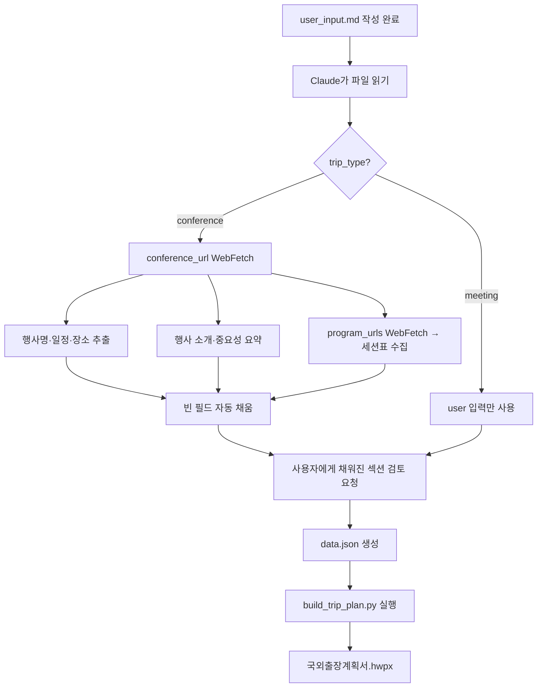

# 🛫 국외출장계획서 작성 입력서

> [!important] 사용법 (Quick Start)
> 1. 이 파일을 그대로 채우거나, 날짜가 포함된 이름(예: `user_input_2025_05.md`)으로 복사해서 작성.
> 2. 상단 **frontmatter**의 `trip_type`을 지정 — `meeting` / `conference` / `auto`.
> 3. **conference 모드**는 `conference_url`(학회·행사 공식 홈페이지)을 반드시 입력.
>    → Claude가 `WebFetch`로 행사 정보를 자동 수집해 채운다.
> 4. **필수(⭐)** 섹션만 채우면 최소 동작. 나머지는 비워두면 Claude가 자동 보완한다.
> 5. 작성 후 Claude에게 **"이 파일로 국외출장계획서 만들어줘"** 라고 요청.

> [!note] 표 작성이 번거로우면
> 모든 표는 **자유 서술로 대체 가능**하다. 표 대신 `- 항목: 값` 형식이나 자연어로 써도 Claude가 해석한다.

---

## 0. 출장 유형 선택 ⭐

> [!tip]
> - 해외기관과의 **미팅·회담**(MOU, 기술이전, 협력 협의) → `meeting`
> - **학회·전시회** 참석 (Display Week, SID, CES, SEMICON 등) → `conference`
> - 양쪽 혼합이면 주 목적 기준으로 선택

- [ ] 🏢 **기관 방문·회담** (meeting)
- [ ] 🎤 **학회·전시회 참석** (conference)
- [ ] 🔀 혼합 — Claude가 판단

---

## 1. 신청자 정보 ⭐

| 항목 | 값 |
|------|----|
| 제출일자 | 예: `2025. 05. 01.` |
| 소속 | 예: `나노디스플레이연구실` |
| 직급 | 예: `책임연구원` |
| 성명 | 예: `김 재 현` |

---

## 2. 출장 개요 ⭐

| 항목 | 값 |
|------|----|
| 출장 기간 (시작) | 예: `2025.05.11.(일)` |
| 출장 기간 (종료) | 예: `2025.05.22.(목)` |
| 일수 라벨 | 예: `10박 12일` (비워두면 자동계산) |
| 출장 국가 | 예: `미국` |
| 방문 도시 | 예: `샌프란시스코, 보스턴` |
| 주 목적 한 줄 | 예: `SID Display Week 2025 참석 및 MIT 국제공동연구 Workshop 개최` |

---

## 3. 출장 목적 ⭐

> [!note] 작성 가이드
> - `meeting` 모드: `○` 불릿으로 2~4개의 협력·협의 핵심 사항
> - `conference` 모드: 학회 개요는 Claude가 웹에서 가져옴. 여기엔 **출장자 관점 목적**만 2~3개 기술

- 
- 
- 

---

## 4. 학회·행사 정보 🌐 *(conference 모드 필수)*

> [!important] WebFetch 자동 수집 대상
> `conference_url`이 frontmatter에 입력되어 있으면 Claude가 다음 정보를 **자동으로 수집**한다:
> - 행사명 / 부제
> - 개최 기간 / 장소 / 주최
> - 행사 소개 (About 페이지)
> - 규모·중요성 (참가자 수·논문 수·트랙 수)
> - 주요 프로그램 구성 (Symposium / Conference / Exhibition / Tutorial 등)
> - 세션 리스트 (날짜 · 세션번호 · 제목 · 트랙)
>
> **사용자는 다음만 수동 입력하면 된다**: URL, 관심 트랙 키워드

### 4.1 행사 URL
| 항목 | 값 |
|------|----|
| 공식 홈페이지 (필수) | frontmatter `conference_url`에 입력 |
| 프로그램 페이지 (선택) | frontmatter `program_urls`에 배열로 입력 |
| 전시회 부스 페이지 (선택) |  |
| PDF 브로셔 경로 (선택) | 로컬 파일 경로 가능 |

### 4.2 관심 트랙·키워드
> Claude가 세션을 필터링할 때 사용한다. 없으면 전체를 수집.

- 예: `Micro-LED`, `AR/VR Display`, `EL-QLED`, `Flexible Displays`
- 

### 4.3 (선택) 이미 정해진 관심 세션
> 미리 정해둔 세션이 있다면 여기 적는다. 없으면 Claude가 웹에서 수집한 뒤 사용자가 편집.

| 날짜 | 세션번호 | 발표제목 | 참석자 |
|------|---------|---------|-------|
|      |         |         |       |

### 4.4 학회 기간 중 부가 방문 기관 (선택)
> 예: Meta(Menlo Park), Apple, MIT, NIST — 기관별 상세는 Section 5에 기재

- 

---

## 5. 기관별 방문 상세 🏢 *(meeting 모드 필수 / conference 모드 선택)*

> [!note]
> - `meeting` 모드: 방문하는 **모든 기관**을 블록으로 기술
> - `conference` 모드: 학회 외 별도 방문 기관(예: Meta, Apple)이 있을 때만 기술

### 기관 1
| 항목 | 값 |
|------|----|
| 기관명 | 예: `Harvard Medical School(HMS)` |
| 방문 일자 | 예: `2024.06.24.(월)` |
| 방문 장소 | 예: `미국 보스턴` |
| 면담자 | 예: `이학호 교수(하버드의대) 외` |
| 배경 |  |
| 목적 |  |
| 협의 주제 (여러 개) | -   - |
| 협력 책임자 | 예: `유영은 (나노리소그래피연구센터)` |

### 기관 2
| 항목 | 값 |
|------|----|
| 기관명 |  |
| 방문 일자 |  |
| 방문 장소 |  |
| 면담자 |  |
| 배경 |  |
| 목적 |  |
| 협의 주제 | - |
| 협력 책임자 |  |

> 📌 기관이 더 있으면 위 블록을 복사해서 추가.

---

## 6. 출장자·동행자 ⭐

### 6.1 본인 포함 전체 출장자 목록
| No | 성명 | 직책/소속 | 수행 업무 | 동행 범위 |
|----|------|----------|----------|----------|
| 1  |      |          |          | 전체일정 |
| 2  |      |          |          |          |

> 동행 범위 예: `전체일정`, `부분동행(보스턴)`, `독립`

### 6.2 출장자 그룹 *(conference 모드)*
> 출장자마다 일정이 다를 때 그룹을 지정. 1개 그룹이면 생략 가능.

- 그룹 A: 
- 그룹 B: 
- 그룹 C: 

---

## 7. 세부 일정 ⭐

> [!tip]
> - **meeting 모드**: 일자별로 방문기관과 업무를 구체적으로 기재
> - **conference 모드**: 입/출국일·학회 참석일·부가 방문일만 기재하면 충분
> - 날짜·시간만 정해두면 Claude가 "업무수행내용"은 Section 4·5에서 자동 생성

### 7.1 그룹 A 일정 (또는 전체)
| 월일(요일) | 출발지 | 도착지 | 방문기관 | 업무수행내용 | 면담예정자 |
|-----------|-------|-------|---------|-------------|-----------|
|           |       |       |         |             |           |
|           |       |       |         |             |           |

### 7.2 그룹 B 일정 (선택)
| 월일(요일) | 출발지 | 도착지 | 방문기관 | 업무수행내용 | 면담예정자 |
|-----------|-------|-------|---------|-------------|-----------|
|           |       |       |         |             |           |

---

## 8. 출장자별 연구과제 연결 *(conference 모드 권장)*

> [!note]
> 출장 경비를 과제 계정에서 집행하는 경우 반드시 기재.

| 출장자 | 관련 과제명 | 계정번호 | 연구내용 요약 | 출장에서 수행할 내용 |
|--------|------------|---------|--------------|--------------------|
|        |            |         |              |                    |
|        |            |         |              |                    |

---

## 9. 최근 3년간 국외출장 실적

> 본인·동행자 각각 최근 3년간 출장 이력을 기재. 없으면 "해당없음".

| 성명 | 출장기간 | 출장국(지역) | 출장목적 |
|------|---------|--------------|----------|
|      |         |              |          |
|      |         |              |          |

---

## 10. 출장 예산 ⭐

| 항목 | 값 |
|------|----|
| 통화 | `KRW` / `USD` |
| 기본 지급계정 |  |

### 10.1 출장자별 예산 (KRW 기준)
| 출장자 | 교통비 | 일비 | 식비 | 숙박비 | 합계 | 지급계정 |
|--------|-------|------|------|-------|------|----------|
|        |       |      |      |       |      |          |
|        |       |      |      |       |      |          |

### 10.2 항목별 예산 (USD 기준, meeting 모드 선택)
| 항목 | 기준액 | 수량 | 소계 | 비고 |
|------|-------|------|------|------|
| 왕복교통비 |       |      |      |      |
| 도시간이동 |       |      |      |      |
| 숙박비 |       |      |      |      |
| 일비 |       |      |      |      |
| 식비 |       |      |      |      |

---

## 11. 연구관련 반출 예정 전산장비·자료

| 항목 | 값 |
|------|----|
| 반출 목적 |  |
| 반출 자료 내용 |  |

### 출장자별 반출 장비 체크
| 구분 | 출장자1 | 출장자2 | 출장자3 | 출장자4 |
|------|--------|--------|--------|--------|
| 노트북/태블릿PC | N/A | N/A | N/A | N/A |
| USB | N/A | N/A | N/A | N/A |
| 외장하드디스크 | N/A | N/A | N/A | N/A |
| 기타 | N/A | N/A | N/A | N/A |
| 인쇄물 | N/A | N/A | N/A | N/A |

> 장비 반출 시 `N/A` 대신 모델명/수량 기재.

---

## 12. 기대효과 (선택)

> 비워두면 Claude가 출장목적·수행내용에서 자동 생성.

- 
- 

---

## 13. 기타 메모·첨부

> 특이사항, 참고 링크, 비자 관련, 포럼 프로그램 사본 링크 등.

- 

---

## 🤖 Claude 처리 워크플로우 (참고용)

### WebFetch 동작 규칙 (Claude 내부 규칙)

| 단계 | 동작 |
|------|------|
| 1 | `conference_url`이 있으면 메인 페이지 fetch |
| 2 | "About", "Program", "Schedule", "Sessions" 링크 자동 탐지 |
| 3 | `program_urls` 배열의 모든 URL 순차 fetch |
| 4 | JS-heavy 사이트/PDF만 있는 경우 → 사용자에게 PDF 경로 요청 |
| 5 | 수집된 세션을 Section 4.3 표에 병합 (사용자 기입 우선) |
| 6 | 관심 트랙 키워드(Section 4.2)로 필터링 |
| 7 | 빈 필드만 채우고, 사용자가 이미 쓴 필드는 **절대 덮어쓰지 않음** |
| 8 | 수집 실패 시 사용자에게 1회 확인 질문 후 진행 |

---

#trip-plan #input-form #overseas-trip #hwpx-skill
