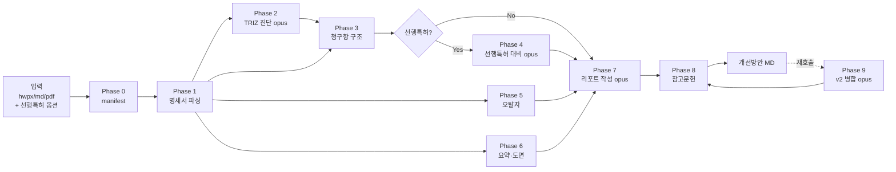

# patent-draft-review — 특허 명세서 초안 검토 스킬

## When to Use

- 출원 전 특허 명세서(HWPX/MD/PDF) 초안의 **종합 검토**가 필요할 때
- 명세서의 **진보성·청구범위·오탈자·요약** 품질을 한 번에 점검하고 싶을 때
- 선행특허 분석 결과(이미 조사한 MD 파일)가 있어 이를 명세서와 통합 검토하려 할 때
  - **선행특허 PDF 확보**가 필요하면 `~/.claude/skills/_shared/scripts/download_patent_pdf.py`(KIPRIS/Google Patents)로 먼저 받고 `pdf-to-md` 스킬로 MD 변환. 절차 표준은 `~/.claude/skills/_shared/patent_pdf_download.md` 참조. **출원번호↔공개번호 혼동 금지**(KR 번호 체계 주의).
- TRIZ 방법론으로 명세서가 해결한 모순 vs 남은 모순을 진단하고 싶을 때
- "명세서 검토", "특허 초안 검토", "진보성 향상" 등 키워드 언급 시

## Do NOT Use

- **신규 발명내용설명서 작성**: `patent-incubation-auto` 또는 `patent-incubation-interactive` 사용
- **거절 이유 통지 후 당소의견안 작성**: `patent-defence` 사용 (본 스킬은 출원 **전** 예방)
- **특허 포트폴리오 전략 수립**: `patent-strategy-pro` 사용
- **학술 논문 리뷰**: `paper-review` 사용

## 기존 스킬과의 차별점

| 스킬 | 시점 | 대상 | 산출물 |
|------|------|------|--------|
| `patent-incubation-auto` | 발명 단계 | 아이디어 → 신규 | 발명내용설명서 HWPX/MD |
| `patent-incubation-interactive` | 발명 단계 | 아이디어 (대화형) → 신규 | 발명내용설명서 |
| **`patent-draft-review`** (본 스킬) | **출원 전** | **기존 명세서 초안** | **개선방안 MD** |
| `patent-defence` | 거절 후 | 거절 이유 통지 | 당소의견안 |
| `patent-strategy-pro` | 포트폴리오 | RFP/기술 분야 | 전략 보고서 |

## Workflow 개요



## Phase 상세

| Phase | 목적 | 모델 | 에이전트 | 입력 | 출력 |
|-------|------|------|----------|------|------|
| **0** | 입력 수집 + manifest | (orchestrator) | (없음, SKILL.md) | 파일 경로, 옵션 | `review_manifest.json` |
| **1** | 명세서 파싱 + 9섹션 구조화 | sonnet | `phase1-spec-parser` | hwpx/md | `spec_structure.json` |
| **2** | TRIZ 진단 (모순·IFR) | **opus** | `phase2-triz-diagnose` | spec + TRIZ ref | `triz_diagnosis.json` |
| **3** | 청구항 구조 진단 | sonnet | `phase3-claim-structure` | spec + TRIZ(옵션) | `claim_analysis.json` |
| **4** | 선행특허 대비 (옵션) | **opus** | `phase4-prior-art-diff` | 선행특허 MD + triz + claim | `prior_art_diff.json` |
| **5** | 오탈자·부호·용어·수식 | sonnet | `phase5-proofreader` | 원문 + typo_scanner | `proofread.json` |
| **6** | 요약서·대표도·도면·효과 | sonnet | `phase6-abstract-drawings` | spec + claim | `abstract_drawings.json` |
| **7** | 개선방안 MD 통합 작성 | **opus** | `phase7-report-writer` | 모든 이전 출력 | `{발명명}_개선방안.md` (v1) |
| **8** | 참고문헌 섹션 자동 생성 | sonnet | `phase8-references-generator` | phase4 + spec 인용 | MD에 §참고문헌 append |
| **9** | v2 업데이트 (재호출) | **opus** | `phase9-updater` | 기존 v1 MD + 신규 선행특허 | v2 MD (섹션 병합) |

## Phase 0 — Orchestration 로직 (SKILL.md 내장)

### 0.1 입력 파싱

```
사용자 호출 예시:
  Skill("patent-draft-review", args="C:/.../draft.hwpx")
  Skill("patent-draft-review", args="C:/.../draft.hwpx --prior-art C:/.../진보성향상방안.md")
  Skill("patent-draft-review", args="draft.hwpx --mvp")  # MVP 모드: Phase 4/6/8/9 생략
```

### 0.2 review_manifest.json 생성

아래 스키마로 `{작업디렉토리}/.omc/state/review_manifest.json` 작성:

```json
{
  "input": {
    "spec_file": "절대경로",
    "spec_format": "hwpx | md | pdf",
    "prior_art_file": "절대경로 또는 null",
    "output_dir": "절대경로 (기본: 원본 hwpx와 동일 디렉토리)",
    "invention_id": "파일명에서 추출",
    "invention_title": "(Phase 1에서 채움)",
    "language": "ko | en"
  },
  "options": {
    "parallel": true,
    "degraded_on_phase2_fail": true,
    "mvp_mode": false,
    "mask_confidential": true
  },
  "phases": {
    "phase1": {"status": "pending", "output": null},
    "phase2": {"status": "pending", "output": null},
    "phase3": {"status": "pending", "output": null},
    "phase4": {"status": "pending", "output": null, "skip_if_no_prior_art": true},
    "phase5": {"status": "pending", "output": null},
    "phase6": {"status": "pending", "output": null},
    "phase7": {"status": "pending", "output": null},
    "phase8": {"status": "pending", "output": null},
    "phase9": {"status": "pending", "output": null, "only_on_recall": true}
  },
  "security": {
    "log_redaction": true,
    "web_fetch_allowed": false,
    "confidential_keywords": ["미공개", "출원 전", "영업 비밀"]
  }
}
```

### 0.3 에이전트 호출 순서

```
1. Phase 1 실행 → spec_structure.json 대기
2. Phase 1 완료 후 Phase 2, 5, 6 병렬 호출 (3개 동시)
3. Phase 2 완료 후 Phase 3 호출 (Phase 1도 완료 상태)
4. prior_art_file != null 이면 Phase 2 + Phase 3 완료 후 Phase 4 호출
5. 모든 Phase 완료 후 Phase 7 (리포트 작성) 호출
6. Phase 7 완료 후 Phase 8 (참고문헌) 호출
7. 재호출 시 Phase 9 (v2 병합) 호출
```

## 보안 규칙 (R-13 필수 준수)

> [!danger] 미공개 출원 내용 유출 방지
> 본 스킬은 출원 전 특허 명세서를 다룬다. 아래 규칙을 **반드시** 준수할 것.

1. **WebFetch/WebSearch 전면 금지**: 에이전트 프롬프트 내에서 명세서 본문을 외부 API로 전송하지 않는다. 참고문헌 링크 생성은 **오프라인 정규식 기반 URL 조립**만 허용한다 (Google Patents/DOI 표준 URL 포맷). 생성된 URL의 실시간 유효성 검증은 본 스킬 범위 외이며, 사용자가 Obsidian에서 직접 확인한다.
2. **로그 redaction**: 에이전트 호출 시 청구항 전문을 로그에 노출하지 않는다.
3. **`.gitignore` 등록**: `tests/regression/input/*.hwpx`, `*.md` 등을 `.gitignore`에 추가하여 공개 저장소 커밋 방지.
4. **Confidential 키워드 탐지**: manifest의 `security.confidential_keywords`에 해당 단어 포함 시 자동으로 출력 파일명에 `_CONFIDENTIAL` 접미사.

## 출력 파일 규칙

| 시나리오 | 파일명 | 저장 위치 |
|----------|--------|-----------|
| v1 (선행특허 없음) | `{invention_id}_개선방안.md` | 원본 hwpx와 동일 디렉토리 |
| v1 (선행특허 있음) | `{invention_id}_개선방안.md` | 원본 hwpx와 동일 디렉토리 |
| v2 (재호출) | `{invention_id}_개선방안.md` (in-place 업데이트) | 섹션 단위 병합, 덮어쓰기 금지 |
| Confidential | `{invention_id}_개선방안_CONFIDENTIAL.md` | — |

## 사용 예시

### 예시 1 — 기본 검토 (선행특허 없이)

```
사용자: "C:/.../P26057KR1_TB26021K-초안.hwpx 파일을 검토해 줘"

Claude가 자동으로:
1. patent-draft-review 트리거 감지
2. Skill("patent-draft-review", args="C:/.../P26057KR1_TB26021K-초안.hwpx")
3. Phase 0~8 실행 (Phase 4 선행특허 비교 생략)
4. 산출물: `C:/.../P26057KR1_TB26021K_개선방안.md` (v1)
```

### 예시 2 — 선행특허 분석 포함 검토

```
사용자: "draft.hwpx를 진보성향상방안.md와 함께 검토"

Claude:
1. Skill("patent-draft-review", args="draft.hwpx --prior-art 진보성향상방안.md")
2. Phase 0~8 모두 실행
3. 산출물: `draft_개선방안.md` (v1, §4 선행특허 대비 포함)
```

### 예시 3 — v1 생성 후 선행특허 추가 분석 (v2 업데이트)

```
사용자: "방금 만든 개선방안.md에 진보성향상방안 반영해 줘"

Claude:
1. Skill("patent-draft-review", args="기존_개선방안.md --prior-art 진보성향상방안.md --update")
2. Phase 9 (v2 병합) 실행 → 섹션 단위 업데이트
3. 산출물: 기존 파일 in-place 갱신 (§4, §6, §10, §11 갱신)
```

## 재사용 자산

본 스킬은 아래 기존 자산을 재사용한다:

| 자산 | 출처 | 용도 |
|------|------|------|
| `triz-40-principles.md` | `patent-incubation-auto/reference/` | Phase 2 TRIZ 40 원리 |
| `triz-contradiction-matrix.json` | 동일 출처 | Phase 2 모순 매트릭스 |
| `triz-separation-principles.md` | 동일 출처 | Phase 2 분리 법칙 |
| `text_extract.py` | `hwpx-xml/scripts/` | Phase 1 HWPX → 텍스트 추출 (래핑) |

## 품질 기준

| 수용 기준 | 임계값 |
|-----------|--------|
| TRIZ 모순 도출 (P26057 베이스라인) | 기술적 ≥ 4, 물리적 ≥ 2 |
| IFR 도출 (P26057 베이스라인) | ≥ 10건 |
| 오탈자 검출 (P26057 베이스라인) | ≥ 5건 |
| 신규 종속항 제안 (P26057 베이스라인) | ≥ 10건 |
| 참고문헌 DOI/Google Patents 링크 | 100% 논문/특허 |
| Obsidian 호환 | YAML + Mermaid ≥ 2 + 콜아웃 ≥ 3 |
| 회귀 재현율 (P26057 N=1) | 섹션 일치 ≥ 90%, 오탈자 재현 ≥ 85% |

## 변경 이력

- **v0.1 (M1 MVP)** — 2026-04-11: Foundation 구축 (SKILL.md + 6 템플릿). Phase 에이전트 미구현.
- **v0.2 (예정, M2)** — Phase 1, 5 에이전트 구현 (명세서 파싱 + 오탈자 검출)
- **v0.3 (예정, M3)** — Phase 2, 3 에이전트 구현 (TRIZ 진단 + 청구항 구조)
- **v0.4 (예정, M5-lite)** — Phase 7 에이전트 구현 (리포트 작성, 선행특허 없이)
- **v1.0 (예정)** — MVP 완성, P26057KR1 회귀 테스트 합격

## 참고

- 설계 플랜 원본: `C:/Users/JHKIM/Claude_Work/patent_A_CLASS/.omc/plans/patent-draft-review-skill-plan.md`
- 회귀 베이스라인: `tests/regression/P26057KR1-baseline/`
- 관련 스킬: `patent-incubation-auto`, `patent-incubation-interactive`, `patent-defence`, `patent-strategy-pro`
