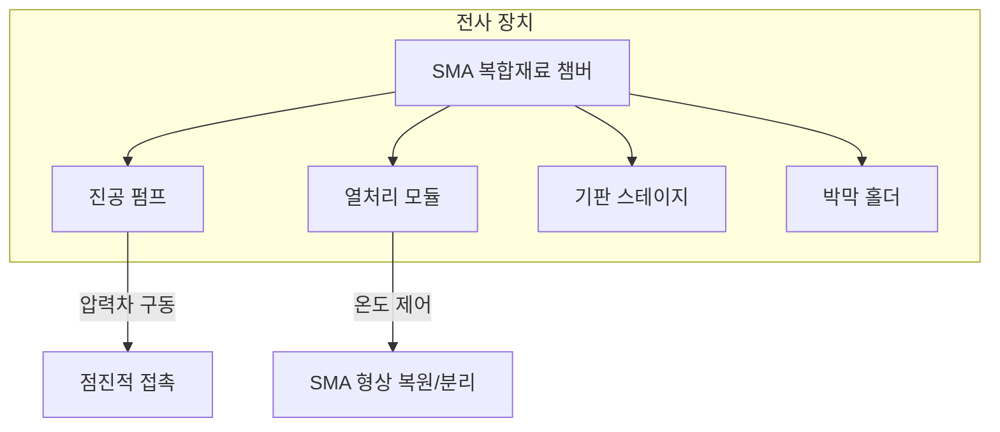
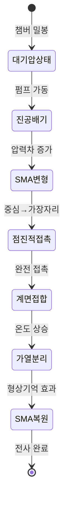
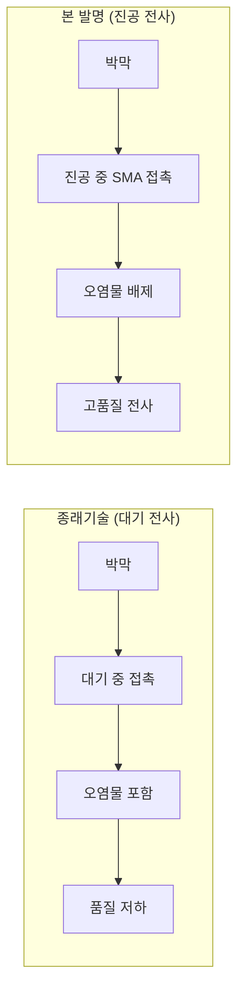
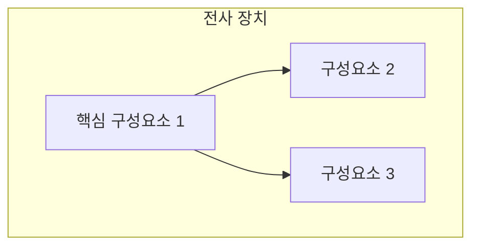

# Phase 6b: 기술 도면 자동 생성

## 목적

발명내용설명서의 §6(구성)과 §9(추가자료)에 기술된 장치/방법/공정을 시각화한다.

- **발명내용설명서 MD** → Mermaid 코드 블록을 인라인 삽입 (Obsidian에서 직접 렌더링)
- **HWPX** → matplotlib로 PNG 파일 생성 (convert_hwpx.py가 §9에 삽입)

### 다이어그램 정책

| 유형 | 도구 | 출력 형식 | 삽입 위치 |
|------|------|---------|----------|
| 코드화 가능 (흐름도, 구성도, 상태도, 비교표) | **Mermaid** | 인라인 코드 | 발명내용설명서 MD 직접 임베드 |
| **기술 단면도, 구조도, schematic** ⭐ | **손코딩 SVG (Write tool)** | `.svg` (vector) | figures/*.svg → 변환 후 모든 매체 |
| 데이터 플롯, 그래프 | matplotlib PNG | `.png` | output/diagrams/*.png (fallback) |
| 자유 형식 스케치 | Excalidraw / 사진 → AI vision 해석 | `.svg` | 사용자 별도 생성 시 |

⭐ **권장 우선순위**: 기술 단면도·schematic은 손코딩 SVG가 가장 강력. 자세한 디자인
컨벤션·primitives·변환 파이프라인은 `reference/svg-figure-creation.md` 참조.

## 입력

1. `발명내용설명서 MD` (Phase 6 출력) — §6 구성 내용과 §9 도면 목록
2. `triz_system.json` (Phase 1) — 시스템 구성요소 관계
3. `evaluation.json` (Phase 4) — 상위 IFR 목록
4. `invention_manifest.json` — 발명 기본 정보

## 작업

### Step 1: 도면 목록 결정

`발명내용설명서 MD`의 §9(추가자료)에서 도면 목록을 추출한다.
도면 목록이 없으면 §6 내용을 분석하여 필요 도면을 자동 결정한다.

**기본 도면 세트** (특허 유형별):

| 도면 유형 | 방법 특허 | 장비 특허 | 소자 특허 |
|-----------|----------|----------|----------|
| 전체 시스템 구성도 | O | O | - |
| 공정 흐름도 (flowchart) | O | - | - |
| 장치 단면도/구조도 | - | O | - |
| 작동 원리도 (상태 변화) | O | O | - |
| 종래기술 vs 본 발명 비교도 | O | O | O |
| 소자 구조 단면도 | - | - | O |

### Step 2: Mermaid 다이어그램 생성

Obsidian 호환 Mermaid 코드를 생성한다. 도면 유형별 템플릿:

#### 2-1. 전체 시스템 구성도 (block diagram)



#### 2-2. 공정 흐름도 (flowchart)


#### 2-3. 작동 원리도 (상태 변화)



#### 2-4. 종래기술 vs 본 발명 비교도



### Step 3 (권장): 손코딩 SVG 기술 도면 생성

기술 단면도·schematic·구조도는 **손코딩 SVG**가 가장 강력하다. LLM이 Write tool로
SVG XML을 직접 작성하여 figures/*.svg 파일 생성. 3가지 매체별 변환 파이프라인을
거쳐 HWPX·PowerPoint·웹 모두에 활용 가능.

**상세 가이드**: `reference/svg-figure-creation.md` (디자인 컨벤션·primitives·변환 §1~9 전체)

#### 3-1) SVG 작성 워크플로우

```
1. viewBox 크기 결정 (보통 900 × 560)
2. defs (markers, gradients) 정의
3. 배경·기판 → 중간 도형 → 작은 도형 → 연결선·화살표 → 라벨 → 노트 순으로 composition
4. 디자인 컨벤션 (svg-figure-creation.md §2 색상 의미 팔레트):
   - 빨강 #c83232 = p, 파랑 #1f6dd1 = n, 금 #d4a017 = p-pad, 회색 #aaa = n-pad
   - PDMS body: #cfe0f7 fill + #1f4068 stroke
   - 활성/점등: #ffcb47, EL 광 화살표: #ffaa00
5. 모든 <text>에 font-family + font-size 명시 (PowerPoint 호환성)
```

#### 3-2) SVG → PNG (HWPX 임베드용) ⭐ 필수

```bash
python scripts/svg2png.py --src figures/ --dst figures/png/ --dpi 200
```

내부 4중 방어:
1. `sys.modules['cairocffi'] = None` — Windows libcairo-2.dll 부재 우회
2. Malgun Gothic + Arial Unicode MS 폰트 등록
3. SVG 사전 치환 (`↳→→`, `−→-`)
4. svg2rlg() 트리 walk + String.fontName 강제 override

→ `convert_hwpx.py`가 이 PNG를 §9 셀에 삽입.

#### 3-3) SVG → EMF (PowerPoint metafile용)

```bash
python scripts/svg2emf.py --src figures/ --dst figures/emf/
```

요구: Inkscape 1.x (`winget install --id Inkscape.Inkscape`).
주의: Inkscape EMF 백엔드는 Korean 텍스트를 **항상 path로 변환**한다 (텍스트 시각 보존, 편집 불가).

#### 3-4) SVG → Outlined SVG (PowerPoint Convert-to-Shape용) ⭐⭐ 가장 견고

```bash
python scripts/outline_svg_text.py --src figures/ --dst figures/pptx/
```

fonttools로 모든 `<text>`를 Bezier `<path>`로 outline. 폰트 의존성 영구 제거 →
PowerPoint에서 "도형으로 변환" 시 100% 시각 보존 보장.

**왜 필요한가**: PowerPoint의 SVG-to-Shape converter는 Korean 텍스트를 강제로 누락하는
알려진 버그가 있어 `font-family="Malgun Gothic"` 명시·@font-face 모두 무시한다.
Text-to-path outline이 유일한 100% 작동 방식.

#### 3-5) 최종 산출물 구조

```
figures/
├── fig1_*.svg              # 원본 (text 포함, svglib·HWPX·웹용)
├── fig2_*.svg
├── png/                    # SVG → PNG (HWPX 임베드)
│   ├── fig1_*.png
│   └── ...
├── emf/                    # SVG → EMF (PowerPoint metafile)
│   └── fig*.emf
└── pptx/                   # SVG → outlined SVG (PowerPoint shape)
    └── fig*.svg            # text → path 변환 완료
```

---

### Step 4: Python matplotlib 도면 생성 (데이터 플롯 한정)

Mermaid·SVG로 표현하기 어려운 데이터 플롯·그래프는 Python matplotlib로 생성한다.
**기술 단면도·schematic은 Step 3 (SVG) 사용 권장.**

```python
import matplotlib.pyplot as plt
import matplotlib.patches as patches
from matplotlib.patches import FancyBboxPatch
import os

def create_cross_section_diagram(output_dir, filename):
    """장치 단면도 생성"""
    fig, ax = plt.subplots(1, 1, figsize=(10, 8))

    # 챔버 외벽 (SMA)
    chamber = FancyBboxPatch((1, 1), 8, 6,
                              boxstyle="round,pad=0.1",
                              facecolor='lightsteelblue',
                              edgecolor='navy', linewidth=2)
    ax.add_patch(chamber)

    # 기판
    substrate = patches.Rectangle((2, 2), 6, 0.5,
                                   facecolor='gold', edgecolor='black')
    ax.add_patch(substrate)
    ax.text(5, 2.25, '기판', ha='center', va='center', fontsize=10)

    # 박막
    film = patches.Rectangle((2, 3.5), 6, 0.3,
                              facecolor='lightcoral', edgecolor='black')
    ax.add_patch(film)
    ax.text(5, 3.65, '나노박막', ha='center', va='center', fontsize=10)

    # 화살표: 압력차 방향
    ax.annotate('대기압\n(외부)', xy=(0.5, 4), fontsize=9,
                ha='center', va='center')
    ax.annotate('', xy=(1.5, 4), xytext=(0.5, 4),
                arrowprops=dict(arrowstyle='->', color='red', lw=2))

    ax.annotate('진공\n(내부)', xy=(5, 5.5), fontsize=9,
                ha='center', va='center')

    # SMA 벽 레이블
    ax.text(0.8, 7.2, 'SMA 복합재료 챔버 벽', fontsize=11,
            fontweight='bold', color='navy')

    ax.set_xlim(0, 10)
    ax.set_ylim(0, 8)
    ax.set_aspect('equal')
    ax.axis('off')
    ax.set_title('발명 장치 단면도', fontsize=14, fontweight='bold')

    filepath = os.path.join(output_dir, filename)
    fig.savefig(filepath, dpi=150, bbox_inches='tight',
                facecolor='white', edgecolor='none')
    plt.close(fig)
    return filepath

def create_process_flow_diagram(output_dir, filename, steps):
    """공정 흐름 다이어그램 생성"""
    fig, ax = plt.subplots(1, 1, figsize=(14, 4))

    n = len(steps)
    for i, step in enumerate(steps):
        x = i * 2
        box = FancyBboxPatch((x, 0.5), 1.5, 1,
                              boxstyle="round,pad=0.1",
                              facecolor='lightyellow', edgecolor='black')
        ax.add_patch(box)
        ax.text(x + 0.75, 1, step, ha='center', va='center',
                fontsize=8, wrap=True)

        if i < n - 1:
            ax.annotate('', xy=((i+1)*2, 1), xytext=(x+1.5, 1),
                        arrowprops=dict(arrowstyle='->', color='black', lw=1.5))

    ax.set_xlim(-0.5, n * 2)
    ax.set_ylim(0, 2)
    ax.set_aspect('equal')
    ax.axis('off')
    ax.set_title('전사 공정 흐름도', fontsize=14, fontweight='bold')

    filepath = os.path.join(output_dir, filename)
    fig.savefig(filepath, dpi=150, bbox_inches='tight',
                facecolor='white', edgecolor='none')
    plt.close(fig)
    return filepath
```

### Step 4: 발명내용설명서 MD에 Mermaid 다이어그램 인라인 삽입

발명내용설명서 MD의 §6(구성)과 §9(추가자료)에 Mermaid 코드 블록을 직접 삽입한다.
Obsidian에서 바로 렌더링되므로 별도 파일이 필요 없다.

**§6에 삽입하는 Mermaid** (발명 구성 설명 보조):
- 전체 시스템 구성도 (`graph TD`)
- 공정 흐름도 (`flowchart LR`)
- 작동 원리 상태 변화도 (`stateDiagram-v2`)

**§9에 삽입하는 Mermaid** (추가자료 도면):
- 종래기술 vs 본 발명 비교도 (`graph LR` with subgraph)
- 구성요소 관계도 (`graph TD`)

삽입 형식:
````markdown
[도 1] 전체 시스템 구성도



[도 2] 공정 흐름도


````

### Step 5: PNG 도면 생성 (HWPX 삽입용)

Mermaid와 별도로, HWPX에 삽입할 PNG 파일을 matplotlib로 생성한다.
(HWPX는 Mermaid를 렌더링할 수 없으므로 PNG가 필요)

```
{output_dir}/diagrams/
├── fig1_system_overview.png      # 전체 시스템 구성도
├── fig2_process_flow.png         # 공정 흐름도
├── fig3_cross_section.png        # 장치 단면도
├── fig4_operating_principle.png  # 작동 원리도
└── fig5_comparison.png           # 종래기술 vs 본 발명 비교
```

## 출력

1. `{output_dir}/발명내용설명서 MD` 업데이트 — §6, §9에 Mermaid 인라인 삽입
2. `{output_dir}/diagrams/*.png` — HWPX 삽입용 PNG 도면
3. manifest 업데이트: `"phase6b": {"status": "completed", "output": "diagrams/", "diagram_count": N}`

## 주의사항

- **Mermaid 우선**: 코드로 표현 가능한 도면은 반드시 Mermaid로 발명내용설명서 MD에 인라인 삽입
- **PNG 병행**: HWPX 삽입용으로 matplotlib PNG도 함께 생성
- **Excalidraw 미사용**: 에이전트가 Excalidraw 파일을 생성하지 않는다 (사용자가 핸드라이팅 시에만 직접 생성)
- matplotlib 한글 폰트: `plt.rcParams['font.family'] = 'Malgun Gothic'` (Windows)
- 도면 번호는 [도 1], [도 2] ... 형식으로 통일
- 특허 도면 스타일: 흑백 기본, 강조만 제한적 색상
