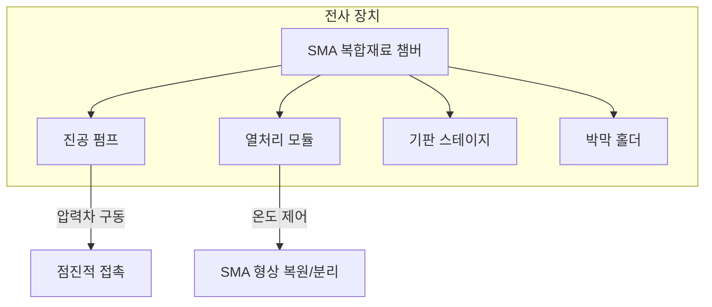
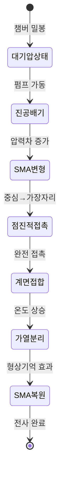
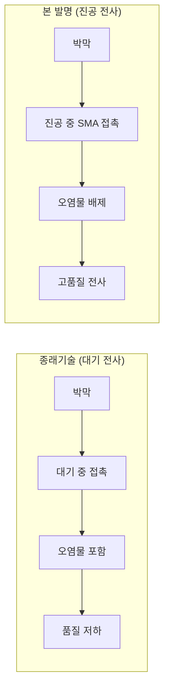

# Phase 6b: 기술 도면 자동 생성

## 목적

발명내용설명서의 §6(발명의 구성)에 기술된 장치/방법/공정을 시각화하여 HWPX 삽입용 도면 및 Obsidian 삽입용 Mermaid 다이어그램을 생성한다.

## 입력

1. `disclosure.md` (Phase 6 출력) — §6 구성 내용과 §9 도면 목록
2. `triz_system.json` (Phase 1) — 시스템 구성요소 관계
3. `evaluation.json` (Phase 4) — 상위 IFR 목록
4. `invention_manifest.json` — 발명 기본 정보

## 작업

### Step 1: 도면 목록 결정

`disclosure.md`의 §9(추가자료)에서 도면 목록을 추출한다.
도면 목록이 없으면 §6 내용을 분석하여 필요 도면을 자동 결정한다.

**기본 도면 세트** (특허 유형별):

| 도면 유형 | 방법 특허 | 장비 특허 | 소자 특허 |
|-----------|----------|----------|----------|
| 전체 시스템 구성도 | O | O | - |
| 공정 흐름도 (flowchart) | O | - | - |
| 장치 단면도/구조도 | - | O | - |
| 작동 원리도 (상태 변화) | O | O | - |
| 종래기술 vs 본 발명 비교도 | O | O | O |
| 소자 구조 단면도 | - | - | O |

### Step 2: Mermaid 다이어그램 생성

Obsidian 호환 Mermaid 코드를 생성한다. 도면 유형별 템플릿:

#### 2-1. 전체 시스템 구성도 (block diagram)



#### 2-2. 공정 흐름도 (flowchart)


#### 2-3. 작동 원리도 (상태 변화)



#### 2-4. 종래기술 vs 본 발명 비교도



### Step 3: Python matplotlib 도면 생성 (선택적)

Mermaid로 표현하기 어려운 기술 도면(단면도, 구조 상세도)은 Python matplotlib/PIL로 생성한다.

```python
import matplotlib.pyplot as plt
import matplotlib.patches as patches
from matplotlib.patches import FancyBboxPatch
import os

def create_cross_section_diagram(output_dir, filename):
    """장치 단면도 생성"""
    fig, ax = plt.subplots(1, 1, figsize=(10, 8))

    # 챔버 외벽 (SMA)
    chamber = FancyBboxPatch((1, 1), 8, 6,
                              boxstyle="round,pad=0.1",
                              facecolor='lightsteelblue',
                              edgecolor='navy', linewidth=2)
    ax.add_patch(chamber)

    # 기판
    substrate = patches.Rectangle((2, 2), 6, 0.5,
                                   facecolor='gold', edgecolor='black')
    ax.add_patch(substrate)
    ax.text(5, 2.25, '기판', ha='center', va='center', fontsize=10)

    # 박막
    film = patches.Rectangle((2, 3.5), 6, 0.3,
                              facecolor='lightcoral', edgecolor='black')
    ax.add_patch(film)
    ax.text(5, 3.65, '나노박막', ha='center', va='center', fontsize=10)

    # 화살표: 압력차 방향
    ax.annotate('대기압\n(외부)', xy=(0.5, 4), fontsize=9,
                ha='center', va='center')
    ax.annotate('', xy=(1.5, 4), xytext=(0.5, 4),
                arrowprops=dict(arrowstyle='->', color='red', lw=2))

    ax.annotate('진공\n(내부)', xy=(5, 5.5), fontsize=9,
                ha='center', va='center')

    # SMA 벽 레이블
    ax.text(0.8, 7.2, 'SMA 복합재료 챔버 벽', fontsize=11,
            fontweight='bold', color='navy')

    ax.set_xlim(0, 10)
    ax.set_ylim(0, 8)
    ax.set_aspect('equal')
    ax.axis('off')
    ax.set_title('발명 장치 단면도', fontsize=14, fontweight='bold')

    filepath = os.path.join(output_dir, filename)
    fig.savefig(filepath, dpi=150, bbox_inches='tight',
                facecolor='white', edgecolor='none')
    plt.close(fig)
    return filepath

def create_process_flow_diagram(output_dir, filename, steps):
    """공정 흐름 다이어그램 생성"""
    fig, ax = plt.subplots(1, 1, figsize=(14, 4))

    n = len(steps)
    for i, step in enumerate(steps):
        x = i * 2
        box = FancyBboxPatch((x, 0.5), 1.5, 1,
                              boxstyle="round,pad=0.1",
                              facecolor='lightyellow', edgecolor='black')
        ax.add_patch(box)
        ax.text(x + 0.75, 1, step, ha='center', va='center',
                fontsize=8, wrap=True)

        if i < n - 1:
            ax.annotate('', xy=((i+1)*2, 1), xytext=(x+1.5, 1),
                        arrowprops=dict(arrowstyle='->', color='black', lw=1.5))

    ax.set_xlim(-0.5, n * 2)
    ax.set_ylim(0, 2)
    ax.set_aspect('equal')
    ax.axis('off')
    ax.set_title('전사 공정 흐름도', fontsize=14, fontweight='bold')

    filepath = os.path.join(output_dir, filename)
    fig.savefig(filepath, dpi=150, bbox_inches='tight',
                facecolor='white', edgecolor='none')
    plt.close(fig)
    return filepath
```

### Step 4: 도면 파일 출력

생성된 도면을 `{output_dir}/diagrams/` 디렉토리에 저장:

```
{output_dir}/diagrams/
├── fig1_system_overview.png      # 전체 시스템 구성도
├── fig2_process_flow.png         # 공정 흐름도
├── fig3_cross_section.png        # 장치 단면도
├── fig4_operating_principle.png  # 작동 원리도
├── fig5_comparison.png           # 종래기술 vs 본 발명 비교
└── fig6_device_structure.png     # 소자 구조 (해당 시)
```

### Step 5: disclosure.md 도면 참조 추가

`disclosure.md`의 §9 섹션에 도면 참조를 추가:

```markdown
### 도면 목록

1. **[도 1]** 전체 시스템 구성도 — ![[fig1_system_overview.png]]
2. **[도 2]** 전사 공정 흐름도 — ![[fig2_process_flow.png]]
3. **[도 3]** 전사 장치 단면도 — ![[fig3_cross_section.png]]
4. **[도 4]** 작동 원리도 (상태 변화) — ![[fig4_operating_principle.png]]
5. **[도 5]** 종래기술 vs 본 발명 비교도 — ![[fig5_comparison.png]]
```

## 출력

1. `{output_dir}/diagrams/*.png` — 기술 도면 이미지 파일들
2. `{output_dir}/disclosure.md` 업데이트 — §9에 도면 참조 추가
3. manifest 업데이트: `"phase6b": {"status": "completed", "output": "diagrams/", "diagram_count": N}`

## 주의사항

- matplotlib에서 한글 폰트 설정 필요: `plt.rcParams['font.family'] = 'Malgun Gothic'` (Windows) 또는 환경에 맞는 한글 폰트
- 도면은 특허 도면 규격에 맞게 흑백 또는 제한적 색상 사용
- Mermaid 다이어그램은 disclosure.md에 인라인으로 포함 (Obsidian 렌더링)
- PNG 도면은 HWPX 삽입용으로도 활용 가능 (Phase 7에서 BinData에 추가)
- 도면 번호는 [도 1], [도 2] ... 형식으로 통일
