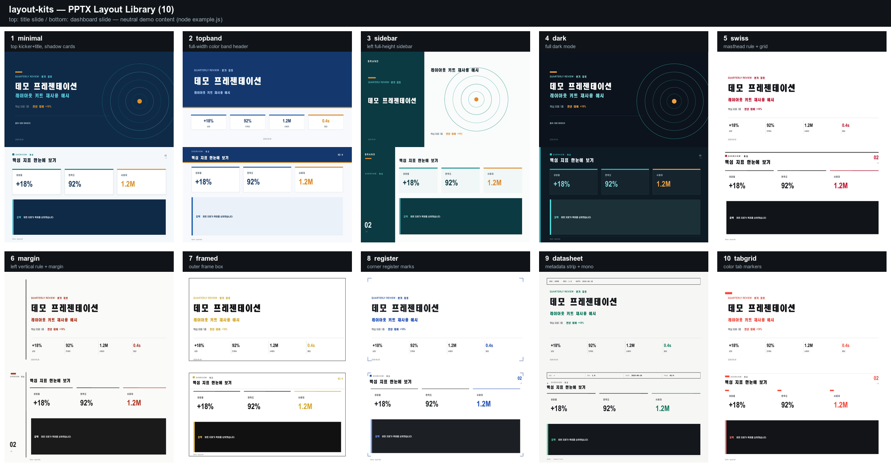

# pptx-layout-kits — 재사용 PPTX 레이아웃 라이브러리 (10종)

콘텐츠 코드를 `content().area` 사각형 기준 **상대 좌표**로 한 번만 작성하면,
레이아웃 이름 문자열 하나로 10종 룩(팔레트+페이지 크롬)을 오가는 PptxGenJS 라이브러리.
표·네이티브 차트·이미지(GIF 포함)를 지원하고 라이트/다크 킷에 자동 적응한다.



## 레이아웃 10종

| 계열 | 이름 | 시그니처 |
|---|---|---|
| Modern | `minimal` `topband` `sidebar` `dark` | 그림자 카드 / 상단 컬러밴드 / 좌측 사이드바 / 다크모드 |
| Swiss | `swiss` `margin` `framed` `register` `datasheet` `tabgrid` | 마스트헤드 룰 / 세로 룰 / 프레임 박스 / 레지스터 마크 / DOC-REV 메타스트립 / 컬러 탭 |

기술 스펙·특허·FEM 보고에는 `datasheet`, 공식 결재 문서에는 `topband`, 키노트형 발표에는 `dark` 권장.

## 사용법

```bash
npm i -g pptxgenjs   # 최초 1회 (pptxgenjs 4.x 검증)
```

```js
const pptxgen = require("pptxgenjs");
const { makeDeck } = require(require("os").homedir() + "/.claude/skills/pptx-layout-kits/assets/layouts.js");

const d = makeDeck(pptxgen, "datasheet", { total: 8, brand: "KIMM" }); // ← 이름만 바꾸면 룩 전환
d.title({ eyebrow: "REPORT", title: "제목", subtitle: "부제",
          stats: [{ v: "42%", label: "지표" }], date: "2026-07-25" });

const { slide, area: A } = d.content("SECTION", "슬라이드 제목"); // area = {x,y,w,h}
d.card(slide, A.x, A.y, A.w / 2 - 0.2, A.h);
d.statCard(slide, A.x + A.w / 2 + 0.2, A.y, A.w / 2 - 0.2, 1.5, true);
// slide.addChart(d.charts.BAR, data, d.chartOpts({ x, y, w, h }));
// slide.addTable([[d.th("열1"), d.th("열2")], ...rows], { ... });

d.closing({ title: "결론", body: "요약 문장", stats: [{ v: "42%", label: "지표" }] });
await d.save("out.pptx");
```

## 원칙

- **좌표는 `area` 상대 배치**: 레이아웃마다 area 사각형이 다르므로(사이드바는 x 이동,
  밴드는 y 이동) 분수 좌표로 쓰면 10종 전부에서 자동 리플로우된다.
- **색은 `d.k.*` 토큰만 사용, hex 하드코딩 금지**: 라이트/다크 킷 자동 적응의 전제.
- 한글 기본 폰트: macOS `Apple SD Gothic Neo` / Windows `맑은 고딕` (자동 선택).

## 데모·QA

```bash
node ~/.claude/skills/pptx-layout-kits/assets/example.js          # 10종 전부 → demo-<name>.pptx
node ~/.claude/skills/pptx-layout-kits/assets/example.js swiss    # 1종만
soffice --headless --convert-to pdf out.pptx && pdftoppm -jpeg -r 150 out.pdf slide   # 육안 QA
```

전체 API(덱 멤버·색 토큰·좌표 모델·페이지 번호 규칙)는 `assets/README.md` 참고.

## 유사 스킬 라우팅

- 편집 가능한 **네이티브 PPTX**를 코드로 → **이 스킬**
- 애니메이션 **HTML 프레젠테이션** → `frontend-slides`
- Gemini 렌더링 **이미지 슬라이드** → `visual-generator` 플러그인
- matplotlib **도표를 다듬어 PPTX로** → `figure-polish`
